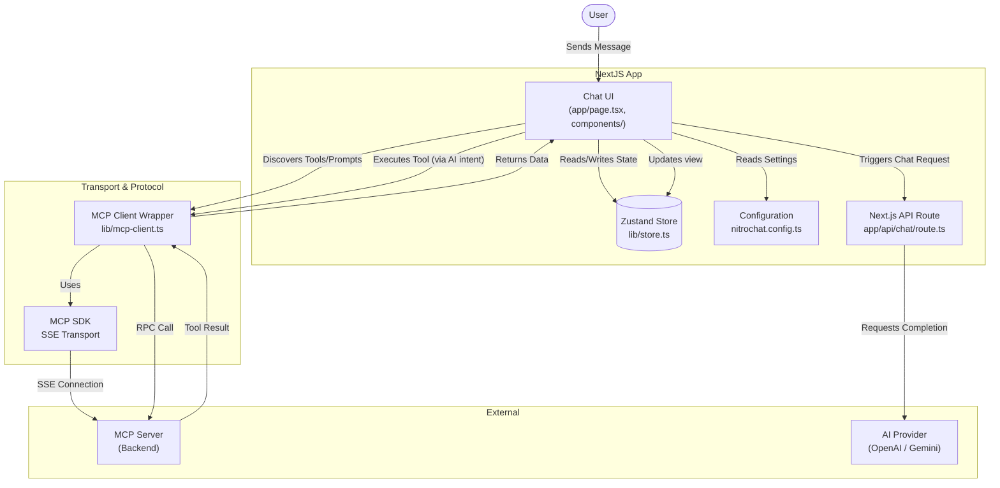

# NitroChat Architecture & Design

## 🎯 Purpose
NitroChat is a production-ready, highly configurable web-based chat application designed to be the frontend interface for Model Context Protocol (MCP) servers. Its primary purpose is to provide users with a rich, interactive, and customizable chat experience where AI models can leverage tools, prompts, and resources exposed by an MCP backend via HTTP and Server-Sent Events (SSE). 

## 🏗️ System Architecture
The application is structured as a monolithic frontend heavily driven by client-side state and real-time backend communication.

### Core Technologies
- **Framework:** Next.js 14 (App Router)
- **Language:** TypeScript
- **Styling:** Tailwind CSS
- **State Management:** Zustand (with local storage persistence)
- **Real-time Protocol:** Model Context Protocol (MCP) using EventSource/SSE

### High-Level Components
1. **User Interface (UI):** React components handling chat display, markdown rendering, tool call visualization, and settings.
2. **State Management (`lib/store.ts`):** A centralized Zustand store managing chat history, OAuth tokens, configured MCP tools/resources, and ElevenLabs voice settings.
3. **MCP Client (`lib/mcp-client.ts`):** A wrapper around the official `@modelcontextprotocol/sdk`. It establishes SSE connections to the MCP backend, intercepts URL mismatches (e.g., rewriting `/mcp` to `/mcp/message`), handles unsolicited server responses, and facilitates RPC calls for tools, prompts, and resources.
4. **Configuration Layer (`nitrochat.config.ts`):** A comprehensive configuration system defining themes, branding, feature flags, AI provider defaults (OpenAI vs. Gemini), and security constraints. Environment variables are loaded and merged here.

## 🎨 Design Philosophy
- **Client-Heavy & Decoupled:** The frontend owns the conversation state and UI logic, remaining largely decoupled from the specific AI provider logic, which is abstracted behind standardized chat endpoints and the MCP client capabilities.
- **Resilient & Self-Healing:** The MCP client intercepts raw EventSource behaviors, intelligently rewriting endpoint URLs when mismatches occur between connection endpoints and message endpoints, and implements retry logic for hanging connections.
- **Configurable & Thematic:** A fully dynamic theme system allows deployment-specific customizations (colors, logos, features) without touching the core UI components.

## 🔄 Interaction Flowchart

Below is a Mermaid flowchart demonstrating how the components interact during a user query:

## ⚙️ Key Subsystems

### 1. Connection Initialization
- **Action:** Application mounts and requests MCP connection.
- **Flow:** `lib/mcp-client.ts` initializes -> Creates patched `EventSource` to handle server URL mismatches -> Instantiates `SSEClientTransport` -> Verifies server capabilities.

### 2. Capabilities Discovery
- **Action:** Once connected, the UI needs to know what it can do.
- **Flow:** The `McpClient` fetches `listTools()`, `listPrompts()`, and `listResources()` -> Dispatches results to `lib/store.ts` -> UI (e.g. `ChatInput`, `Sidebar`) updates to display available slash commands or buttons.

### 3. Messaging & Tool Execution
- **Action:** User sends a query that requires an MCP tool.
- **Flow:** 
  1. The message is sent to the chat API endpoint.
  2. The AI provider responds, indicating a tool call is needed.
  3. The frontend `McpClient` directly executes the `callTool` RPC via the SSE connection.
  4. The result is appended to the chat flow, and control is returned to the user or AI for generation.

### 4. Audio/Voice Integration
- **Action:** User enables voice capabilities.
- **Flow:** Zustand store tracks Voice configurations (`voiceModeType`, ElevenLabs API Key) -> `voice-utils` trigger synthesis -> Plays via `VoiceOrbOverlay` or `VoiceChatPopup` components.
