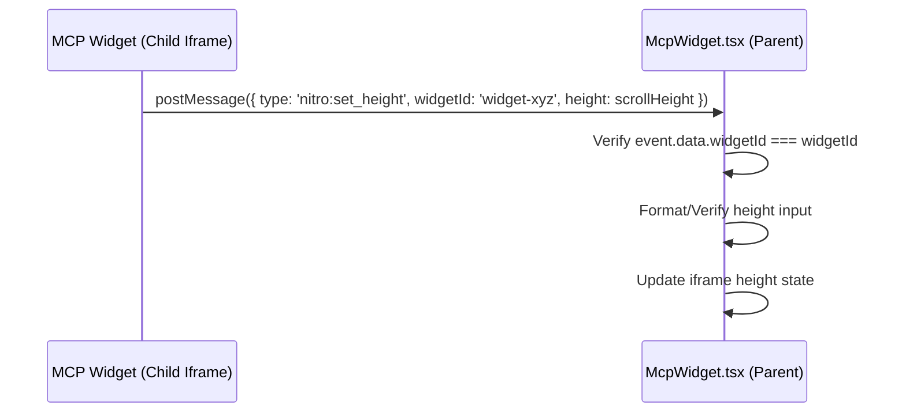

# Dynamic Height Control for MCP UI Widgets

This document describes the design and implementation of dynamic height control for inline MCP widgets rendering in NitroChat using a `postMessage` protocol.

## Problem Description
By default, the iframe rendering the MCP widget has a fixed, responsive CSS clamp boundary:
```css
height: clamp(440px, 72vh, 860px);
min-height: 440px;
```
For simple widgets (like survey dropdowns, feedback inputs, or small confirm buttons), this height is excessively large and leaves empty space.

## Solution: Dynamic Height via postMessage
The parent frame (NitroChat) handles dynamic height updates sent from the child frame (MCP widget) using HTML5 `window.postMessage`. To ensure this does not affect other widgets, the listener filters messages to only allow changes from the specific iframe that requested it via a matching unique `widgetId`.

### Communication Flow


---

## Technical Details

### 1. NitroChat Implementation (Parent Listener)
Modify [McpWidget.tsx](file:///Users/admin/Desktop/imp/zitadel/nitrochat/components/McpWidget.tsx) to manage dynamic height updates:

```typescript
// Helper to support raw numeric height clamping as well as string units (%, rem, vh, etc.)
function formatWidgetHeight(height: unknown): string {
    if (typeof height === 'number') {
        const safeHeight = Math.max(100, Math.min(height, 1200));
        return `${safeHeight}px`;
    }

    if (typeof height === 'string') {
        const trimmed = height.trim();
        if (/^\d+(\.\d+)?$/.test(trimmed)) {
            const parsed = parseFloat(trimmed);
            const safeHeight = Math.max(100, Math.min(parsed, 1200));
            return `${safeHeight}px`;
        }
        return trimmed;
    }

    return 'clamp(440px, 72vh, 860px)';
}

// Inside McpWidget component
const [iframeHeight, setIframeHeight] = useState<string>('clamp(440px, 72vh, 860px)');
const [widgetId] = useState(() => `widget-${Math.random().toString(36).substr(2, 9)}`);
const iframeRef = useRef<HTMLIFrameElement>(null);

useEffect(() => {
    const handleResizeMessage = (event: MessageEvent) => {
        // Isolate style modifications strictly to the requesting widget iframe
        if (event.data?.type === 'nitro:set_height' && event.data?.widgetId === widgetId && event.data?.height !== undefined) {
            setIframeHeight(formatWidgetHeight(event.data.height));
        }
    };

    window.addEventListener('message', handleResizeMessage);
    return () => window.removeEventListener('message', handleResizeMessage);
}, [widgetId]);
```

Apply the dynamic height style to the `iframe` element:
```tsx
return (
    <div className="w-full my-2">
        <iframe
            ref={iframeRef}
            className="w-full border-none bg-transparent rounded-lg"
            style={{
                height: iframeHeight,
                minHeight: iframeHeight === 'clamp(440px, 72vh, 860px)' ? '440px' : 'auto',
            }}
            sandbox="allow-scripts allow-same-origin allow-forms"
            title={`Widget for ${toolName}`}
        />
    </div>
);
```

---

### 2. Client Widget Implementation (Child Integration)
Inside the client widget app (e.g., in [seat-selection/page.tsx](file:///Users/admin/Desktop/imp/zitadel/magic_auth_mcp/src/widgets/app/seat-selection/page.tsx) or other widgets), send the scrollHeight of the root container once the widget mounts or updates:

```typescript
import { useEffect } from 'react';

export default function SurveyWidget() {
    useEffect(() => {
        const rootEl = document.getElementById('widget-root');
        if (rootEl) {
            const widgetId = (window as any).openai?.widgetId;
            window.parent.postMessage({
                type: 'nitro:set_height',
                widgetId: widgetId,
                height: rootEl.scrollHeight + 24
            }, '*');
        }
    }, []);

    return (
        <div id="widget-root" style={{ padding: '16px' }}>
            {/* Widget elements */}
        </div>
    );
}
```

---

## Validation Strategy
1. **Targeted Widgets**: Verify that widgets calling `nitro:set_height` correctly resize down to their contents.
2. **Support for custom units**: Verify that string inputs like `"30rem"` or `"60vh"` correctly translate to style rules.
3. **Default Widgets**: Verify that other widgets continue to use the default `clamp(440px, 72vh, 860px)` styling and are completely unaffected.
