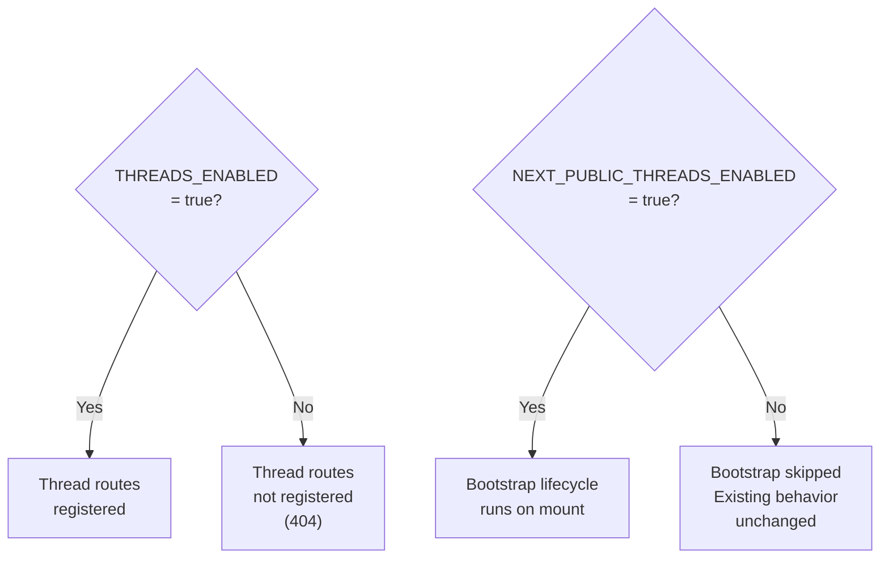

# M0 — Environment & Feature Flag Foundation

> **Status:** `VERIFIED`
> **Branch:** single implementation branch
> **Repos affected:** `nitrostack-gateway`, `nitrochat`
> **Estimated effort:** 0.5h
> **Risk level:** None — no logic changes, configuration only

---

## Objective

Establish the shared environment setup and feature flag infrastructure that all subsequent milestones depend on. After this milestone, both services run locally with ClickHouse available, and a `THREADS_ENABLED` toggle exists in both repos so every future milestone can be safely gated.

**Success criteria:** Both services start cleanly, `THREADS_ENABLED=false` is the default, and ClickHouse responds to a health ping.

---

## Scope

- Add `THREADS_ENABLED` boolean config field to `nitrostack-gateway`
- Add `NEXT_PUBLIC_THREADS_ENABLED` env var to `nitrochat`
- Document local ClickHouse setup
- No logic changes — pure configuration additions

---

## Dependencies

None. This is the root milestone.

---

## Impacted Areas

| Area | File | Change type |
|---|---|---|
| Gateway config | `internal/config/config.go` | Add `ThreadsEnabled bool` field |
| Gateway env | `.env` | Add `THREADS_ENABLED=false` |
| Frontend env | `.env.local` | Add `NEXT_PUBLIC_THREADS_ENABLED=false` |

---

## Environment Changes

### nitrostack-gateway `.env`

```bash
# Threads feature flag
THREADS_ENABLED=false

# ClickHouse (local dev)
CLICKHOUSE_HOST=localhost
CLICKHOUSE_PORT=9000
CLICKHOUSE_USER=default
CLICKHOUSE_PASSWORD=
CLICKHOUSE_DATABASE=nitrostack
```

### nitrochat `.env.local`

```bash
# Threads feature flag
NEXT_PUBLIC_THREADS_ENABLED=false

# Gateway base URL (already present — verify it matches your local gateway)
NITROCHAT_GATEWAY_URL=http://localhost:8080
```

---

## Step-by-Step Implementation Tasks

### Gateway — `internal/config/config.go`

1. Locate the `Config` struct.
2. Add one field:
   ```go
   ThreadsEnabled bool
   ```
3. In the `Load()` function, read the env var:
   ```go
   ThreadsEnabled: os.Getenv("THREADS_ENABLED") == "true",
   ```
4. No other changes to config.

### nitrochat — environment

1. Create or update `.env.local`:
   ```bash
   NEXT_PUBLIC_THREADS_ENABLED=false
   ```
2. Confirm `NITROCHAT_GATEWAY_URL` is already set and points to your local gateway.

### Local ClickHouse setup

```bash
# Pull and start ClickHouse in Docker
docker run -d \
  --name ch-threads-dev \
  -p 9000:9000 \
  -p 8123:8123 \
  clickhouse/clickhouse-server:latest

# Wait ~5 seconds, then verify
curl http://localhost:8123/ping
# Expected: "Ok."

# Verify database access
curl "http://localhost:8123/?query=SHOW+DATABASES"
```

> **Note:** ClickHouse is already wired in the gateway via `CLICKHOUSE_HOST`. Existing `studio_usage_logs` flow continues working independently of this milestone.

---

## Feature Flag Behavior (across all milestones)



Both flags default to `false`. Turning one on without the other is safe:
- Gateway on, frontend off: routes available but frontend never calls them
- Frontend on, gateway off: bootstrap runs, calls fail, falls back to local-only mode

---

## Validation Checklist

- [ ] `nitrostack-gateway` starts without errors (`go run ./cmd/server`)
- [ ] `GET http://localhost:8080/health` returns `200`
- [ ] `nitrochat` dev server starts without errors (`npm run dev`)
- [ ] ClickHouse ping succeeds: `curl http://localhost:8123/ping` → `Ok.`
- [ ] `THREADS_ENABLED=false` confirmed in gateway env
- [ ] `NEXT_PUBLIC_THREADS_ENABLED=false` confirmed in nitrochat env
- [ ] Existing `/v1/nitrochat/chat/completions` still responds normally
- [ ] Existing NitroChat chat UI loads and sends messages normally

---

## Smoke Tests

```bash
# 1. Gateway health
curl -s http://localhost:8080/health | jq .status

# 2. ClickHouse ping
curl -s http://localhost:8123/ping

# 3. ClickHouse database list
curl -s "http://localhost:8123/?query=SELECT+currentDatabase()"

# 4. Existing NitroChat route still works
curl -s -X POST http://localhost:8080/v1/nitrochat/chat/completions \
  -H "X-API-Key: $NC_API_KEY" \
  -H "Content-Type: application/json" \
  -d '{"model":"gpt-4o-mini","messages":[{"role":"user","content":"ping"}]}' | jq .
```

---

## Edge Cases

| Scenario | Behavior |
|---|---|
| ClickHouse not running | Gateway starts in degraded mode (existing behavior — ClickHouse is optional) |
| `THREADS_ENABLED` env var missing | Defaults to `false` — safe |
| `CLICKHOUSE_HOST` env var missing | Existing gateway degraded-mode behavior applies |
| `.env.local` missing in nitrochat | Next.js uses process env fallback — `NEXT_PUBLIC_THREADS_ENABLED` is `undefined` which is treated as `false` |

---

## Temporary Debugging Instructions

```bash
# Gateway: verify config is loaded correctly
# Add temporarily to main.go startup log:
log.Printf("[M0] ThreadsEnabled=%v ClickHouseHost=%s", cfg.ThreadsEnabled, cfg.ClickHouseHost)

# Remove this log line after M0 is verified.
```

---

## Rollback Strategy

No code changes to revert. Simply remove or comment out the two env vars:

```bash
# gateway .env — remove:
THREADS_ENABLED=false

# nitrochat .env.local — remove:
NEXT_PUBLIC_THREADS_ENABLED=false
```

Both services return to pre-milestone state.

---

## Known Risks

| Risk | Likelihood | Mitigation |
|---|---|---|
| ClickHouse port conflict (9000 in use) | Low | Use `-p 19000:9000` and update `CLICKHOUSE_PORT` |
| Docker not available on dev machine | Low | Use ClickHouse Cloud free tier instead |
| `.env.local` committed to git accidentally | Low | Confirm `.env.local` is in `.gitignore` |

---

## Safe Incremental Rollout Notes

- This milestone is purely additive. No existing code path is modified.
- `THREADS_ENABLED=false` is the safe default — the entire thread feature is dark until explicitly enabled.
- Can be deployed to staging environments with `THREADS_ENABLED=false` to verify the flag plumbing without activating any thread logic.

---

## Suggested Commit Checkpoints

```bash
git add internal/config/config.go
git commit -m "feat(threads): add THREADS_ENABLED config flag to gateway (M0)"

git add .env.local
git commit -m "chore(threads): add NEXT_PUBLIC_THREADS_ENABLED env var (M0)"
```

> **Tag after validation:**
> ```bash
> git tag checkpoint/m0-env-ready
> ```

---

## TODO Checklist

```
[ ] Add ThreadsEnabled field to internal/config/config.go
[ ] Add THREADS_ENABLED=false to gateway .env
[ ] Add NEXT_PUBLIC_THREADS_ENABLED=false to nitrochat .env.local
[ ] Start ClickHouse via Docker
[ ] Verify ClickHouse ping
[ ] Verify gateway health endpoint
[ ] Verify nitrochat dev server starts
[ ] Verify existing chat completions still work
[ ] Tag checkpoint/m0-env-ready
```
