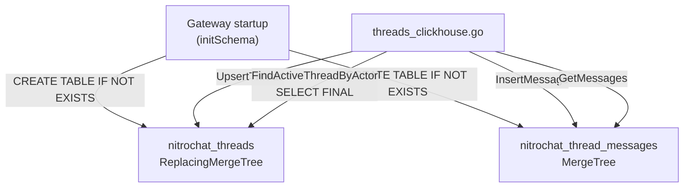

# M1 — ClickHouse Schema + Repository Layer

> **Status:** `VERIFIED`
> **Branch:** single implementation branch
> **Repos affected:** `nitrostack-gateway`
> **Estimated effort:** 2h
> **Risk level:** Low — new tables only; no existing routes modified

---

## Objective

Create the two ClickHouse tables (`nitrochat_threads`, `nitrochat_thread_messages`) and the full Go repository layer that wraps them. The gateway starts, creates the tables automatically, and exposes typed data-access methods. Nothing calls these methods yet — that happens in M3.

**Success criteria:** Gateway starts, logs schema initialization, both tables exist in ClickHouse, and repository methods can be exercised via direct Go test or raw SQL.

---

## Scope

| File | Change |
|---|---|
| `internal/repository/clickhouse.go` | Extend `initSchema()` with 2 new tables |
| `internal/models/threads.go` | New — all DTOs, constants, request/response structs |
| `internal/repository/threads_clickhouse.go` | New — `UpsertThread`, `FindActiveThreadByActor`, `InsertMessage`, `GetMessages` |

---

## Dependencies

- **M0** — ClickHouse running locally, `THREADS_ENABLED` in config

---

## Impacted Areas

- `nitrostack-gateway` repository layer only
- Existing `studio_usage_logs` table and all existing routes are **not modified**

---

## Environment Changes

None beyond M0. Requires `THREADS_ENABLED=true` to see schema init log (schema creation runs regardless — it uses `CREATE TABLE IF NOT EXISTS`).

---

## ClickHouse Schema

### Table: `nitrochat_threads`

```sql
CREATE TABLE IF NOT EXISTS nitrochat_threads (
    thread_id  String,
    actor_id   String,
    actor_type LowCardinality(String),   -- 'anonymous' | 'external' | 'authenticated'
    status     LowCardinality(String),   -- 'active' | 'closed'
    created_at DateTime64(3),
    updated_at DateTime64(3),
    metadata   String DEFAULT '{}'
) ENGINE = ReplacingMergeTree(updated_at)
PARTITION BY toYYYYMM(created_at)
ORDER BY (actor_id, thread_id);
```

**Design notes:**
- `ReplacingMergeTree(updated_at)` — deduplicates by `(actor_id, thread_id)` keeping the row with the highest `updated_at`. Allows idempotent upserts (INSERT to update status).
- `ORDER BY (actor_id, thread_id)` — optimizes the primary access pattern: "find active thread for this actor".
- All reads use `SELECT ... FINAL` to force deduplication before returning results.
- `actor_type` and `status` use `LowCardinality(String)` for compression on the small cardinality set.

### Table: `nitrochat_thread_messages`

```sql
CREATE TABLE IF NOT EXISTS nitrochat_thread_messages (
    thread_id          String,
    actor_id           String,
    message_id         String,
    role               LowCardinality(String),   -- 'user' | 'assistant' | 'tool'
    content            String,
    created_at         DateTime64(3),
    trace_id           String DEFAULT '',
    request_id         String DEFAULT '',
    gateway_version    LowCardinality(String) DEFAULT '',
    deployment_version LowCardinality(String) DEFAULT '',
    environment        LowCardinality(String) DEFAULT 'production',
    prompt_version     String DEFAULT '',
    assistant_version  String DEFAULT '',
    prompt_tokens      UInt32 DEFAULT 0,
    completion_tokens  UInt32 DEFAULT 0,
    reasoning_tokens   UInt32 DEFAULT 0,
    cached_tokens      UInt32 DEFAULT 0,
    ttft               Float32 DEFAULT 0.0,
    stream_duration    Float32 DEFAULT 0.0,
    finish_reason      LowCardinality(String) DEFAULT '',
    retry_count        UInt8 DEFAULT 0,
    metadata           String DEFAULT '{}'
) ENGINE = MergeTree()
PARTITION BY toYYYYMM(created_at)
ORDER BY (thread_id, created_at, message_id);
```

**Design notes:**
- `MergeTree()` — pure append-only. No deduplication. Messages are immutable once written.
- `ORDER BY (thread_id, created_at, message_id)` — primary access pattern: "all messages for thread X in order".
- `message_id` in sort key breaks ties when two messages share the same millisecond timestamp.
- `metadata` stores tool call data, image references, etc. as a JSON string. No schema change needed for new message attributes.

---

## Data Flow Diagram



---

## Step-by-Step Implementation Tasks

### 1. Create `internal/models/threads.go`

```go
package models

import "time"

type ActorType string

const (
    ActorTypeAnonymous     ActorType = "anonymous"
    ActorTypeExternal      ActorType = "external"
    ActorTypeAuthenticated ActorType = "authenticated"
)

type ThreadStatus string

const (
    ThreadStatusActive ThreadStatus = "active"
    ThreadStatusClosed ThreadStatus = "closed"
)

type Actor struct {
    ActorID   string    `json:"actorId"`
    ActorType ActorType `json:"actorType"`
}

type Thread struct {
    ThreadID  string       `json:"threadId"`
    ActorID   string       `json:"actorId"`
    ActorType ActorType    `json:"actorType"`
    Status    ThreadStatus `json:"status"`
    CreatedAt time.Time    `json:"createdAt"`
    UpdatedAt time.Time    `json:"updatedAt"`
    Metadata  string       `json:"metadata"`
}

type ThreadMessage struct {
    ThreadID  string    `json:"threadId"`
    ActorID   string    `json:"actorId"`
    MessageID string    `json:"messageId"`
    Role      string    `json:"role"`
    Content   string    `json:"content"`
    CreatedAt time.Time `json:"createdAt"`
    Metadata  string    `json:"metadata"`
}

// --- Request / Response DTOs ---

type ResolveActorRequest struct {
    ActorID        string `json:"actorId"`
    ExternalUserID string `json:"externalUserId"`
}

type ResolveActorResponse struct {
    ActorID   string    `json:"actorId"`
    ActorType ActorType `json:"actorType"`
}

type ResolveThreadRequest struct {
    ActorID   string    `json:"actorId"`
    ActorType ActorType `json:"actorType"`
}

type ResolveThreadResponse struct {
    ThreadID  string    `json:"threadId"`
    ActorID   string    `json:"actorId"`
    ActorType ActorType `json:"actorType"`
}

type GetMessagesResponse struct {
    Messages []ThreadMessage `json:"messages"`
}

type PostMessageRequest struct {
    ActorID   string `json:"actorId"`
    Role      string `json:"role"`
    Content   string `json:"content"`
    MessageID string `json:"messageId"`
    Metadata  string `json:"metadata"`
}

type PostMessageResponse struct {
    MessageID string `json:"messageId"`
}
```

### 2. Extend `internal/repository/clickhouse.go` — `initSchema()`

After the existing `studio_usage_logs` check, add the thread tables:

```go
// Inside initSchema(), after studio_usage_logs block:

threadTables := []struct {
    name  string
    query string
}{
    {
        name: "nitrochat_threads",
        query: `CREATE TABLE IF NOT EXISTS nitrochat_threads (
            thread_id  String,
            actor_id   String,
            actor_type LowCardinality(String),
            status     LowCardinality(String),
            created_at DateTime64(3),
            updated_at DateTime64(3),
            metadata   String DEFAULT '{}'
        ) ENGINE = ReplacingMergeTree(updated_at)
        PARTITION BY toYYYYMM(created_at)
        ORDER BY (actor_id, thread_id)`,
    },
    {
        name: "nitrochat_thread_messages",
        query: `CREATE TABLE IF NOT EXISTS nitrochat_thread_messages (
            thread_id          String,
            actor_id           String,
            message_id         String,
            role               LowCardinality(String),
            content            String,
            created_at         DateTime64(3),
            trace_id           String DEFAULT '',
            request_id         String DEFAULT '',
            gateway_version    LowCardinality(String) DEFAULT '',
            deployment_version LowCardinality(String) DEFAULT '',
            environment        LowCardinality(String) DEFAULT 'production',
            prompt_version     String DEFAULT '',
            assistant_version  String DEFAULT '',
            prompt_tokens      UInt32 DEFAULT 0,
            completion_tokens  UInt32 DEFAULT 0,
            reasoning_tokens   UInt32 DEFAULT 0,
            cached_tokens      UInt32 DEFAULT 0,
            ttft               Float32 DEFAULT 0.0,
            stream_duration    Float32 DEFAULT 0.0,
            finish_reason      LowCardinality(String) DEFAULT '',
            retry_count        UInt8 DEFAULT 0,
            metadata           String DEFAULT '{}'
        ) ENGINE = MergeTree()
        PARTITION BY toYYYYMM(created_at)
        ORDER BY (thread_id, created_at, message_id)`,
    },
}

for _, t := range threadTables {
    var count uint64
    err := r.conn.QueryRow(ctx,
        "SELECT count() FROM system.tables WHERE database = currentDatabase() AND name = ?",
        t.name,
    ).Scan(&count)
    if err != nil {
        return fmt.Errorf("failed to check table %s: %w", t.name, err)
    }
    if count == 0 {
        if err := r.conn.Exec(ctx, t.query); err != nil {
            return fmt.Errorf("failed to create table %s: %w", t.name, err)
        }
        log.Printf("[threads] created ClickHouse table: %s", t.name)
    }
}
```

### 3. Create `internal/repository/threads_clickhouse.go`

```go
package repository

import (
    "context"
    "fmt"
    "time"

    "github.com/nicepkg/nitrostack/gateway/internal/models"
)

type ThreadsClickHouseRepository struct {
    ch *ClickHouseRepository
}

func NewThreadsClickHouseRepository(ch *ClickHouseRepository) *ThreadsClickHouseRepository {
    return &ThreadsClickHouseRepository{ch: ch}
}

// UpsertThread inserts or replaces a thread row.
// ReplacingMergeTree deduplicates on (actor_id, thread_id) keeping highest updated_at.
func (r *ThreadsClickHouseRepository) UpsertThread(ctx context.Context, t *models.Thread) error {
    return r.ch.conn.Exec(ctx, `
        INSERT INTO nitrochat_threads
            (thread_id, actor_id, actor_type, status, created_at, updated_at, metadata)
        VALUES (?, ?, ?, ?, ?, ?, ?)`,
        t.ThreadID, t.ActorID, string(t.ActorType), string(t.Status),
        t.CreatedAt, t.UpdatedAt, t.Metadata,
    )
}

// FindActiveThreadByActor returns the most recent active thread for an actor.
// Uses FINAL to force ReplacingMergeTree deduplication before reading.
func (r *ThreadsClickHouseRepository) FindActiveThreadByActor(ctx context.Context, actorID string) (*models.Thread, error) {
    row := r.ch.conn.QueryRow(ctx, `
        SELECT thread_id, actor_id, actor_type, status, created_at, updated_at, metadata
        FROM nitrochat_threads FINAL
        WHERE actor_id = ? AND status = 'active'
        ORDER BY created_at DESC
        LIMIT 1`,
        actorID,
    )

    var t models.Thread
    var actorType, status string
    err := row.Scan(&t.ThreadID, &t.ActorID, &actorType, &status, &t.CreatedAt, &t.UpdatedAt, &t.Metadata)
    if err != nil {
        // No rows — caller treats this as "create new thread"
        return nil, err
    }
    t.ActorType = models.ActorType(actorType)
    t.Status = models.ThreadStatus(status)
    return &t, nil
}

// InsertMessage appends a message to a thread.
func (r *ThreadsClickHouseRepository) InsertMessage(ctx context.Context, m *models.ThreadMessage) error {
    if m.Metadata == "" {
        m.Metadata = "{}"
    }
    return r.ch.conn.Exec(ctx, `
        INSERT INTO nitrochat_thread_messages
            (thread_id, actor_id, message_id, role, content, created_at, metadata)
        VALUES (?, ?, ?, ?, ?, ?, ?)`,
        m.ThreadID, m.ActorID, m.MessageID, m.Role, m.Content, m.CreatedAt, m.Metadata,
    )
}

// GetMessages returns paginated messages for a thread in chronological order.
// beforeTs = 0 means "no upper bound" (return latest messages).
func (r *ThreadsClickHouseRepository) GetMessages(ctx context.Context, threadID string, limit int, beforeTs int64) ([]models.ThreadMessage, error) {
    if limit <= 0 || limit > 200 {
        limit = 50
    }

    var query string
    var args []interface{}

    if beforeTs > 0 {
        query = `
            SELECT thread_id, actor_id, message_id, role, content, created_at, metadata
            FROM nitrochat_thread_messages
            WHERE thread_id = ? AND created_at < fromUnixTimestamp64Milli(?)
            ORDER BY created_at ASC, message_id ASC
            LIMIT ?`
        args = []interface{}{threadID, beforeTs, limit}
    } else {
        query = `
            SELECT thread_id, actor_id, message_id, role, content, created_at, metadata
            FROM nitrochat_thread_messages
            WHERE thread_id = ?
            ORDER BY created_at ASC, message_id ASC
            LIMIT ?`
        args = []interface{}{threadID, limit}
    }

    rows, err := r.ch.conn.Query(ctx, query, args...)
    if err != nil {
        return nil, fmt.Errorf("GetMessages query failed: %w", err)
    }
    defer rows.Close()

    var messages []models.ThreadMessage
    for rows.Next() {
        var msg models.ThreadMessage
        if err := rows.Scan(
            &msg.ThreadID, &msg.ActorID, &msg.MessageID, &msg.Role,
            &msg.Content, &msg.CreatedAt, &msg.Metadata,
        ); err != nil {
            return nil, fmt.Errorf("GetMessages scan failed: %w", err)
        }
        messages = append(messages, msg)
    }
    return messages, rows.Err()
}
```

---

## Validation Checklist

- [ ] Gateway starts without errors after changes
- [ ] Startup log shows: `[threads] created ClickHouse table: nitrochat_threads`
- [ ] Startup log shows: `[threads] created ClickHouse table: nitrochat_thread_messages`
- [ ] On second start: no creation logs (tables already exist — IF NOT EXISTS works)
- [ ] `SHOW TABLES` in ClickHouse lists both new tables
- [ ] Existing `studio_usage_logs` table unaffected
- [ ] All existing gateway routes return expected responses
- [ ] No compile errors in new Go files

---

## Smoke Tests

```bash
# 1. Verify tables exist after gateway start
curl -s "http://localhost:8123/?query=SHOW+TABLES" | grep nitrochat

# 2. Verify threads table schema
curl -s "http://localhost:8123/?query=DESCRIBE+TABLE+nitrochat_threads"

# 3. Verify messages table schema
curl -s "http://localhost:8123/?query=DESCRIBE+TABLE+nitrochat_thread_messages"

# 4. Manual insert + select (threads)
curl -s "http://localhost:8123/" \
  --data-urlencode "query=INSERT INTO nitrochat_threads VALUES ('thr_test','anon_test','anonymous','active',now(),now(),'{}')"

curl -s "http://localhost:8123/?query=SELECT+*+FROM+nitrochat_threads+FINAL"

# 5. Manual insert + select (messages)
curl -s "http://localhost:8123/" \
  --data-urlencode "query=INSERT INTO nitrochat_thread_messages VALUES ('thr_test','anon_test','msg_001','user','hello',now(),'{}')"

curl -s "http://localhost:8123/?query=SELECT+*+FROM+nitrochat_thread_messages"

# 6. Cleanup test rows
curl -s "http://localhost:8123/" \
  --data-urlencode "query=ALTER TABLE nitrochat_threads DELETE WHERE thread_id='thr_test'"
curl -s "http://localhost:8123/" \
  --data-urlencode "query=ALTER TABLE nitrochat_thread_messages DELETE WHERE thread_id='thr_test'"
```

---

## Edge Cases

| Scenario | Behavior |
|---|---|
| ClickHouse unavailable on gateway start | `initSchema` returns error; gateway exits — same behavior as existing ClickHouse failure mode |
| Table already exists (re-deploy) | `CREATE TABLE IF NOT EXISTS` is a no-op; no log line emitted |
| `FindActiveThreadByActor` returns no rows | Returns `nil, err` (driver `sql.ErrNoRows` equivalent) — caller in M3 treats this as "create new thread" |
| Two INSERTs with same `(actor_id, thread_id)` in threads table | `ReplacingMergeTree` deduplicates on next merge; FINAL queries show latest row immediately |
| Very long message content | ClickHouse `String` type is unbounded; no truncation |
| `metadata` field empty string | `InsertMessage` normalizes to `{}` |

---

## Temporary Debugging Instructions

```go
// In threads_clickhouse.go — add these temporarily to verify queries:

// In FindActiveThreadByActor:
log.Printf("[threads-repo] FindActiveThreadByActor actor_id=%s", actorID)

// In InsertMessage:
log.Printf("[threads-repo] InsertMessage thread_id=%s message_id=%s role=%s", m.ThreadID, m.MessageID, m.Role)

// In GetMessages:
log.Printf("[threads-repo] GetMessages thread_id=%s limit=%d count=%d", threadID, limit, len(messages))

// Remove all [threads-repo] debug logs in M9.
```

---

## Rollback Strategy

1. Revert changes to `internal/repository/clickhouse.go` (`initSchema` additions)
2. Delete `internal/models/threads.go`
3. Delete `internal/repository/threads_clickhouse.go`
4. Drop tables in ClickHouse (safe — no production data at this stage):

```sql
DROP TABLE IF EXISTS nitrochat_threads;
DROP TABLE IF EXISTS nitrochat_thread_messages;
```

No routes exist yet — rollback has zero user-visible impact.

---

## Known Risks

| Risk | Likelihood | Mitigation |
|---|---|---|
| `SELECT ... FINAL` performance on large datasets | Low (MVP scale) | Acceptable for MVP; add materialized views in future if needed |
| ClickHouse HTTP protocol vs native protocol mismatch | Low | Existing gateway uses HTTP protocol; same connection used |
| ReplacingMergeTree dedup timing (async merge) | Low | FINAL keyword forces sync dedup on read |
| `initSchema` fails on ClickHouse Cloud (permission restrictions) | Medium | Existing `studio_usage_logs` uses same pattern with a pre-existence check — same approach used here |

---

## Safe Incremental Rollout Notes

- Schema creation runs regardless of `THREADS_ENABLED` — tables are always created if ClickHouse is available. This is intentional: creating tables is safe and idempotent. Route access is the gated part.
- Repository layer is passive — no routes call it until M3.
- Can be merged and deployed to staging with `THREADS_ENABLED=false` to verify schema creation without exposing any API surface.

---

## Suggested Commit Checkpoints

```bash
git add internal/models/threads.go
git commit -m "feat(threads/models): add Thread, Actor, ThreadMessage DTOs (M1)"

git add internal/repository/threads_clickhouse.go
git commit -m "feat(threads/repo): add ClickHouse thread repository methods (M1)"

git add internal/repository/clickhouse.go
git commit -m "feat(threads/schema): extend initSchema with thread tables (M1)"
```

> **Tag after validation:**
> ```bash
> git tag checkpoint/m1-schema-ready
> ```

---

## TODO Checklist

```
[ ] Create internal/models/threads.go with all DTOs
[ ] Add ActorType constants (anonymous, external, authenticated)
[ ] Add ThreadStatus constants (active, closed)
[ ] Add request/response structs for all 4 endpoints
[ ] Extend initSchema() in clickhouse.go for nitrochat_threads
[ ] Extend initSchema() in clickhouse.go for nitrochat_thread_messages
[ ] Create internal/repository/threads_clickhouse.go
[ ] Implement UpsertThread
[ ] Implement FindActiveThreadByActor (with FINAL)
[ ] Implement InsertMessage
[ ] Implement GetMessages (with pagination)
[ ] Gateway starts and logs table creation
[ ] SHOW TABLES confirms both tables exist
[ ] Manual SQL smoke tests pass
[ ] Existing routes unaffected
[ ] Tag checkpoint/m1-schema-ready
```
