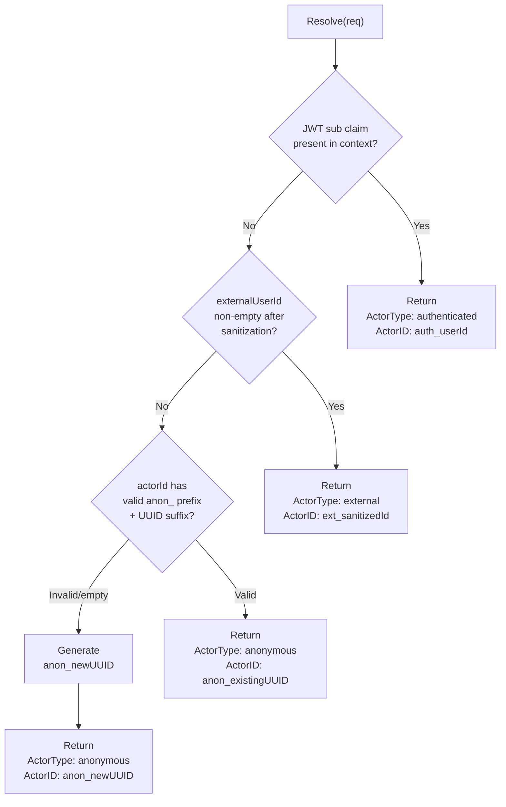

# M2 — Actor Resolution Service

> **Status:** `VERIFIED`
> **Branch:** single implementation branch
> **Repos affected:** `nitrostack-gateway`
> **Estimated effort:** 1.5h
> **Risk level:** Low — isolated service, no HTTP routes wired yet

---

## Objective

Implement the stateless actor resolution service as a pure, unit-testable Go package. No HTTP surface is exposed in this milestone. The service accepts a resolution request and deterministically returns an `Actor` struct following a strict priority chain.

**Success criteria:** All resolution scenarios covered by unit tests; service builds and passes tests cleanly; existing gateway routes unaffected.

---

## Scope

| File | Change |
|---|---|
| `internal/services/actor_resolver.go` | New — full resolution logic |

No handler changes. No route changes. No database writes.

---

## Dependencies

- **M1** — `internal/models/threads.go` must exist (provides `ActorType`, `Actor` types)

---

## Impacted Areas

- `nitrostack-gateway` services layer only
- Zero impact on any existing route or middleware

---

## Environment Changes

None.

---

## Actor Resolution Priority Chain



---

## Actor ID Formats

| Type | Format | Example | Notes |
|---|---|---|---|
| `anonymous` | `anon_<uuid-v4>` | `anon_f47ac10b-58cc-4372-a567-0e02b2c3d479` | Generated once; restored from localStorage |
| `external` | `ext_<sanitized>` | `ext_user_123` | Sanitized to `[a-zA-Z0-9_-]`, max 128 chars |
| `authenticated` | `auth_<userId>` | `auth_sub_abc123` | Future — Zitadel JWT `sub` claim |

---

## Step-by-Step Implementation Tasks

### Create `internal/services/actor_resolver.go`

```go
package services

import (
    "regexp"
    "strings"

    "github.com/google/uuid"
    "github.com/nicepkg/nitrostack/gateway/internal/models"
)

// externalIDPattern allows alphanumeric, underscores, and hyphens only.
var externalIDPattern = regexp.MustCompile(`[^a-zA-Z0-9_-]`)

const (
    maxExternalIDLength = 128
    anonPrefix          = "anon_"
    extPrefix           = "ext_"
    authPrefix          = "auth_"
)

// ActorResolver resolves an incoming request to a canonical Actor.
// It is stateless and has no database dependency.
type ActorResolver struct{}

func NewActorResolver() *ActorResolver {
    return &ActorResolver{}
}

// Resolve applies the priority chain:
//  1. Authenticated (JWT sub — stub for MVP)
//  2. External (externalUserId param)
//  3. Anonymous restore (valid existing actorId)
//  4. Anonymous generate (new UUID)
func (r *ActorResolver) Resolve(req models.ResolveActorRequest) models.Actor {
    // Priority 1: Authenticated (future Zitadel integration — no-op in MVP)
    // When JWT middleware sets a verified sub claim, handle it here.
    // if req.AuthenticatedUserID != "" {
    //     return models.Actor{
    //         ActorID:   authPrefix + req.AuthenticatedUserID,
    //         ActorType: models.ActorTypeAuthenticated,
    //     }
    // }

    // Priority 2: External user ID
    if sanitized := sanitizeExternalID(req.ExternalUserID); sanitized != "" {
        return models.Actor{
            ActorID:   extPrefix + sanitized,
            ActorType: models.ActorTypeExternal,
        }
    }

    // Priority 3: Restore existing anonymous actor
    if validateAnonymousID(req.ActorID) {
        return models.Actor{
            ActorID:   req.ActorID,
            ActorType: models.ActorTypeAnonymous,
        }
    }

    // Priority 4: Generate new anonymous actor
    return models.Actor{
        ActorID:   anonPrefix + uuid.NewString(),
        ActorType: models.ActorTypeAnonymous,
    }
}

// sanitizeExternalID strips disallowed characters and enforces max length.
// Returns empty string if the result is empty after sanitization.
func sanitizeExternalID(raw string) string {
    if raw == "" {
        return ""
    }
    sanitized := externalIDPattern.ReplaceAllString(raw, "")
    if len(sanitized) > maxExternalIDLength {
        sanitized = sanitized[:maxExternalIDLength]
    }
    return sanitized
}

// validateAnonymousID checks that an actor ID has the anon_ prefix
// followed by a valid UUID v4.
func validateAnonymousID(id string) bool {
    if !strings.HasPrefix(id, anonPrefix) {
        return false
    }
    suffix := strings.TrimPrefix(id, anonPrefix)
    _, err := uuid.Parse(suffix)
    return err == nil
}
```

### Unit tests — create `internal/services/actor_resolver_test.go`

```go
package services_test

import (
    "testing"

    "github.com/nicepkg/nitrostack/gateway/internal/models"
    "github.com/nicepkg/nitrostack/gateway/internal/services"
)

func TestActorResolver(t *testing.T) {
    r := services.NewActorResolver()

    t.Run("empty request generates anonymous actor", func(t *testing.T) {
        actor := r.Resolve(models.ResolveActorRequest{})
        if actor.ActorType != models.ActorTypeAnonymous {
            t.Errorf("expected anonymous, got %s", actor.ActorType)
        }
        if len(actor.ActorID) < 6 {
            t.Errorf("actor ID too short: %s", actor.ActorID)
        }
    })

    t.Run("valid anon actorId is restored", func(t *testing.T) {
        id := "anon_f47ac10b-58cc-4372-a567-0e02b2c3d479"
        actor := r.Resolve(models.ResolveActorRequest{ActorID: id})
        if actor.ActorID != id {
            t.Errorf("expected %s, got %s", id, actor.ActorID)
        }
        if actor.ActorType != models.ActorTypeAnonymous {
            t.Errorf("expected anonymous, got %s", actor.ActorType)
        }
    })

    t.Run("invalid anon prefix generates new actor", func(t *testing.T) {
        actor := r.Resolve(models.ResolveActorRequest{ActorID: "anon_not-a-uuid"})
        if actor.ActorID == "anon_not-a-uuid" {
            t.Error("should not restore invalid anon ID")
        }
    })

    t.Run("externalUserId wins over actorId", func(t *testing.T) {
        actor := r.Resolve(models.ResolveActorRequest{
            ActorID:        "anon_f47ac10b-58cc-4372-a567-0e02b2c3d479",
            ExternalUserID: "user123",
        })
        if actor.ActorType != models.ActorTypeExternal {
            t.Errorf("expected external, got %s", actor.ActorType)
        }
        if actor.ActorID != "ext_user123" {
            t.Errorf("expected ext_user123, got %s", actor.ActorID)
        }
    })

    t.Run("externalUserId with special chars is sanitized", func(t *testing.T) {
        actor := r.Resolve(models.ResolveActorRequest{ExternalUserID: "<script>alert(1)</script>"})
        if actor.ActorType != models.ActorTypeExternal {
            t.Errorf("expected external, got %s", actor.ActorType)
        }
        // Should not contain < > ( ) etc.
        if actor.ActorID == "ext_<script>alert(1)</script>" {
            t.Error("special chars not sanitized")
        }
    })

    t.Run("externalUserId with only special chars falls through to anonymous", func(t *testing.T) {
        actor := r.Resolve(models.ResolveActorRequest{ExternalUserID: "!@#$%^&*()"})
        if actor.ActorType != models.ActorTypeAnonymous {
            t.Errorf("expected anonymous after all-special-char external id, got %s", actor.ActorType)
        }
    })

    t.Run("externalUserId truncated to 128 chars", func(t *testing.T) {
        long := strings.Repeat("a", 200)
        actor := r.Resolve(models.ResolveActorRequest{ExternalUserID: long})
        // ext_ prefix (4) + 128 chars = 132 total
        if len(actor.ActorID) > 132 {
            t.Errorf("actor ID too long: %d chars", len(actor.ActorID))
        }
    })
}
```

---

## Validation Checklist

- [ ] `go test ./internal/services/...` — all tests pass
- [ ] Empty request → `anon_<uuid>` generated
- [ ] Valid `anon_<uuid>` actor ID → restored as-is
- [ ] Invalid `anon_` prefix (bad UUID suffix) → new anonymous generated
- [ ] `externalUserId=abc123` → `ext_abc123` returned
- [ ] `externalUserId` with special chars → sanitized, no injection chars in output
- [ ] `externalUserId` all special chars → empty after sanitize → falls to anonymous
- [ ] `externalUserId` 200 chars → truncated to 128 chars max in `ActorID`
- [ ] `externalUserId` + `actorId` both present → external wins
- [ ] `go build ./...` succeeds
- [ ] Existing gateway routes unaffected

---

## Smoke Tests

Since no HTTP routes exist yet, test via unit tests only:

```bash
# Run all service tests
cd nitrostack-gateway
go test ./internal/services/... -v

# Run with race detector
go test -race ./internal/services/...

# Build check
go build ./...
```

---

## Edge Cases

| Scenario | Expected Behavior |
|---|---|
| `actorId = ""` | Falls through all checks → new anonymous generated |
| `actorId = "ext_abc"` | Not a valid `anon_` prefix → new anonymous generated |
| `actorId = "anon_"` (prefix only, no UUID) | UUID parse fails → new anonymous generated |
| `externalUserId = " "` (whitespace only) | Sanitize strips nothing; empty result → fall through to anonymous |
| `externalUserId = "a"` (single char) | Valid → `ext_a` |
| UUID v1/v3/v5 as suffix | `uuid.Parse` accepts all versions — valid anonymous restore |
| Nil/empty `ResolveActorRequest` | All fields are zero values → new anonymous generated |

---

## ZITADEL Future-Compatibility Seam

The `authenticated` actor path is preserved as a commented-out stub:

```go
// Priority 1: Authenticated (future Zitadel integration)
// When JWT middleware sets a verified sub claim:
// if req.AuthenticatedUserID != "" {
//     return Actor{ ActorID: "auth_" + sub, ActorType: ActorTypeAuthenticated }
// }
```

When ZITADEL integration ships:
1. Add `AuthenticatedUserID string` to `ResolveActorRequest`
2. Populate it from the JWT middleware context
3. Uncomment the stub block
4. No schema changes needed — `actor_type = 'authenticated'` is already valid in ClickHouse

---

## Temporary Debugging Instructions

```go
// Add at the end of Resolve(), before return statements:
log.Printf("[actor-resolver] resolved actor_id=%s actor_type=%s", actor.ActorID, actor.ActorType)

// Remove [actor-resolver] debug logs in M9.
```

---

## Rollback Strategy

Delete `internal/services/actor_resolver.go` and `internal/services/actor_resolver_test.go`.

No routes are wired to this service yet — zero user-visible impact.

---

## Known Risks

| Risk | Likelihood | Mitigation |
|---|---|---|
| UUID package not already in `go.mod` | Low | `github.com/google/uuid` is already a direct dependency (used in `clickhouse.go`) |
| `regexp.MustCompile` panics on bad pattern | None | Pattern `[^a-zA-Z0-9_-]` is valid |
| Concurrent calls generating same UUID | Negligible | `uuid.NewString()` is cryptographically random (128-bit) |

---

## Safe Incremental Rollout Notes

- Service is called nowhere until M3 wires it into the handlers.
- Unit tests can be run in CI without any external dependencies (no DB, no gateway running).
- The ZITADEL stub is present but commented — authenticated path will not accidentally activate.

---

## Suggested Commit Checkpoints

```bash
git add internal/services/actor_resolver.go
git commit -m "feat(threads/actor): implement actor resolver service (M2)"

git add internal/services/actor_resolver_test.go
git commit -m "test(threads/actor): unit tests for all resolution scenarios (M2)"
```

> **Tag after validation:**
> ```bash
> git tag checkpoint/m2-actor-resolver
> ```

---

## TODO Checklist

```
[ ] Create internal/services/actor_resolver.go
[ ] Implement sanitizeExternalID with regex + max length
[ ] Implement validateAnonymousID with prefix + UUID check
[ ] Implement Resolve() with full priority chain
[ ] Add ZITADEL stub comment for authenticated path
[ ] Create internal/services/actor_resolver_test.go
[ ] Test: empty request → anonymous generated
[ ] Test: valid anon ID restored
[ ] Test: invalid anon ID → new anonymous
[ ] Test: externalUserId wins over actorId
[ ] Test: special chars sanitized
[ ] Test: all-special-char external ID → anonymous
[ ] Test: externalUserId truncated at 128 chars
[ ] go test ./internal/services/... passes
[ ] go test -race ./internal/services/... passes
[ ] go build ./... succeeds
[ ] Tag checkpoint/m2-actor-resolver
```
