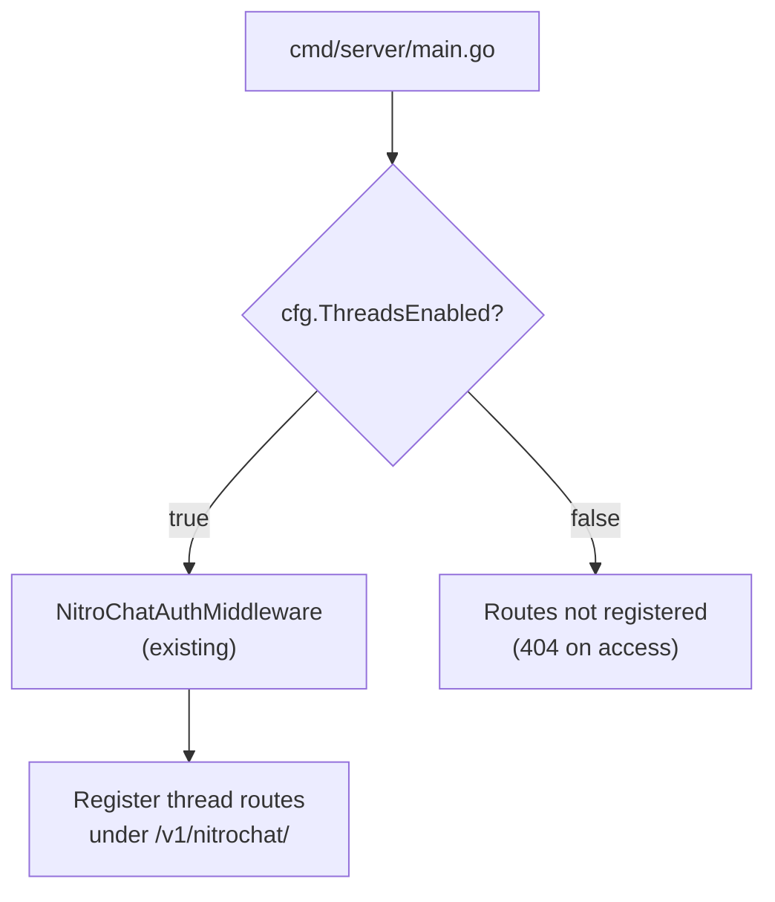

# M3 — Gateway Thread HTTP Handlers

> **Status:** `VERIFIED`
> **Branch:** single implementation branch
> **Repos affected:** `nitrostack-gateway`
> **Estimated effort:** 2h
> **Risk level:** Low — new routes only; existing routes untouched

---

## Objective

Expose the 4 thread API endpoints under the existing `/v1/nitrochat` route group, protected by the existing `NitroChatAuthMiddleware`. Routes are only registered when `THREADS_ENABLED=true`. When the flag is false, the routes simply don't exist (404) and existing behavior is unchanged.

**Success criteria:** All 4 endpoints return correct responses when called with a valid API key, `POST /threads/resolve` is idempotent, and existing `/v1/nitrochat/chat/completions` continues working.

---

## Scope

| File | Change |
|---|---|
| `internal/handlers/threads.go` | New — `ThreadsHandler` with 4 handler methods |
| `cmd/server/main.go` | Modify — wire `ThreadsHandler` into nitrochat auth route group |

---

## Dependencies

- **M1** — `ThreadsClickHouseRepository` available
- **M2** — `ActorResolver` available
- **M0** — `cfg.ThreadsEnabled` field exists

---

## Impacted Areas

- New route group under `/v1/nitrochat/` (existing middleware still wraps all routes)
- `cmd/server/main.go` wiring — minimal surgical change
- All existing `/v1/nitrochat/*` routes: **no change**

---

## Environment Changes

```bash
# Enable thread routes for local testing
THREADS_ENABLED=true
```

---

## API Contracts

### `POST /v1/nitrochat/actor/resolve`

```
Request headers:
  X-API-Key: <nitrochat-api-key>
  Content-Type: application/json

Request body (all fields optional):
{
  "actorId": "anon_f47ac10b-...",
  "externalUserId": "user123"
}

Response 200:
{
  "actorId": "anon_f47ac10b-...",
  "actorType": "anonymous"
}
```

### `POST /v1/nitrochat/threads/resolve`

```
Request:
{
  "actorId": "anon_f47ac10b-...",
  "actorType": "anonymous"
}

Response 200:
{
  "threadId": "thr_<uuid>",
  "actorId": "anon_f47ac10b-...",
  "actorType": "anonymous"
}
```

Idempotent: calling with the same `actorId` always returns the same `threadId` while the thread is active.

### `GET /v1/nitrochat/threads/:threadId/messages`

```
Query params (optional):
  limit=50        (default: 50, max: 200)
  before=<unix_ms> (pagination cursor)

Response 200:
{
  "messages": [
    {
      "messageId": "msg_001",
      "role": "user",
      "content": "Hello",
      "createdAt": "2026-05-25T10:00:00.000Z",
      "metadata": "{}"
    }
  ]
}
```

### `POST /v1/nitrochat/threads/:threadId/messages`

```
Request:
{
  "actorId": "anon_f47ac10b-...",
  "role": "user",
  "content": "Hello",
  "messageId": "msg_client_001",
  "metadata": "{}"
}

Response 200:
{
  "messageId": "msg_client_001"
}
```

---

## Route Registration Flow



---

## Step-by-Step Implementation Tasks

### 1. Create `internal/handlers/threads.go`

```go
package handlers

import (
    "errors"
    "log"
    "strconv"
    "time"

    "github.com/gofiber/fiber/v2"
    "github.com/google/uuid"
    "github.com/nicepkg/nitrostack/gateway/internal/models"
    "github.com/nicepkg/nitrostack/gateway/internal/repository"
    "github.com/nicepkg/nitrostack/gateway/internal/services"
)

type ThreadsHandler struct {
    resolver *services.ActorResolver
    repo     *repository.ThreadsClickHouseRepository
}

func NewThreadsHandler(
    resolver *services.ActorResolver,
    repo *repository.ThreadsClickHouseRepository,
) *ThreadsHandler {
    return &ThreadsHandler{resolver: resolver, repo: repo}
}

// ResolveActor handles POST /v1/nitrochat/actor/resolve
func (h *ThreadsHandler) ResolveActor(c *fiber.Ctx) error {
    var req models.ResolveActorRequest
    if err := c.BodyParser(&req); err != nil {
        // Empty body is valid — all fields are optional
        req = models.ResolveActorRequest{}
    }
    actor := h.resolver.Resolve(req)
    log.Printf("[threads] ResolveActor actor_id=%s actor_type=%s", actor.ActorID, actor.ActorType)
    return c.JSON(models.ResolveActorResponse{
        ActorID:   actor.ActorID,
        ActorType: actor.ActorType,
    })
}

// ResolveThread handles POST /v1/nitrochat/threads/resolve
func (h *ThreadsHandler) ResolveThread(c *fiber.Ctx) error {
    var req models.ResolveThreadRequest
    if err := c.BodyParser(&req); err != nil || req.ActorID == "" {
        return c.Status(fiber.StatusBadRequest).JSON(fiber.Map{
            "error": "actorId is required",
        })
    }

    ctx := c.Context()

    // Try to find existing active thread
    existing, err := h.repo.FindActiveThreadByActor(ctx, req.ActorID)
    if err == nil && existing != nil {
        log.Printf("[threads] ResolveThread found existing thread_id=%s actor_id=%s", existing.ThreadID, req.ActorID)
        return c.JSON(models.ResolveThreadResponse{
            ThreadID:  existing.ThreadID,
            ActorID:   existing.ActorID,
            ActorType: existing.ActorType,
        })
    }

    // Create new thread
    now := time.Now()
    thread := &models.Thread{
        ThreadID:  "thr_" + uuid.NewString(),
        ActorID:   req.ActorID,
        ActorType: req.ActorType,
        Status:    models.ThreadStatusActive,
        CreatedAt: now,
        UpdatedAt: now,
        Metadata:  "{}",
    }
    if err := h.repo.UpsertThread(ctx, thread); err != nil {
        log.Printf("[threads] ResolveThread failed to create thread: %v", err)
        return c.Status(fiber.StatusInternalServerError).JSON(fiber.Map{
            "error": "failed to create thread",
        })
    }

    log.Printf("[threads] ResolveThread created thread_id=%s actor_id=%s", thread.ThreadID, req.ActorID)
    return c.JSON(models.ResolveThreadResponse{
        ThreadID:  thread.ThreadID,
        ActorID:   thread.ActorID,
        ActorType: thread.ActorType,
    })
}

// GetMessages handles GET /v1/nitrochat/threads/:threadId/messages
func (h *ThreadsHandler) GetMessages(c *fiber.Ctx) error {
    threadID := c.Params("threadId")
    if threadID == "" {
        return c.Status(fiber.StatusBadRequest).JSON(fiber.Map{"error": "threadId required"})
    }

    limit, _ := strconv.Atoi(c.Query("limit", "50"))
    beforeTs, _ := strconv.ParseInt(c.Query("before", "0"), 10, 64)

    ctx := c.Context()
    messages, err := h.repo.GetMessages(ctx, threadID, limit, beforeTs)
    if err != nil {
        log.Printf("[threads] GetMessages failed thread_id=%s: %v", threadID, err)
        return c.Status(fiber.StatusInternalServerError).JSON(fiber.Map{"error": "failed to fetch messages"})
    }

    if messages == nil {
        messages = []models.ThreadMessage{}
    }

    log.Printf("[threads] GetMessages thread_id=%s count=%d", threadID, len(messages))
    return c.JSON(models.GetMessagesResponse{Messages: messages})
}

// PostMessage handles POST /v1/nitrochat/threads/:threadId/messages
func (h *ThreadsHandler) PostMessage(c *fiber.Ctx) error {
    threadID := c.Params("threadId")
    if threadID == "" {
        return c.Status(fiber.StatusBadRequest).JSON(fiber.Map{"error": "threadId required"})
    }

    var req models.PostMessageRequest
    if err := c.BodyParser(&req); err != nil {
        return c.Status(fiber.StatusBadRequest).JSON(fiber.Map{"error": "invalid request body"})
    }
    if req.ActorID == "" || req.Role == "" || req.Content == "" || req.MessageID == "" {
        return c.Status(fiber.StatusBadRequest).JSON(fiber.Map{
            "error": "actorId, role, content, and messageId are required",
        })
    }

    msg := &models.ThreadMessage{
        ThreadID:  threadID,
        ActorID:   req.ActorID,
        MessageID: req.MessageID,
        Role:      req.Role,
        Content:   req.Content,
        CreatedAt: time.Now(),
        Metadata:  req.Metadata,
    }

    ctx := c.Context()
    if err := h.repo.InsertMessage(ctx, msg); err != nil {
        log.Printf("[threads] PostMessage failed thread_id=%s message_id=%s: %v", threadID, req.MessageID, err)
        return c.Status(fiber.StatusInternalServerError).JSON(fiber.Map{"error": "failed to save message"})
    }

    log.Printf("[threads] PostMessage thread_id=%s message_id=%s role=%s", threadID, req.MessageID, req.Role)
    return c.JSON(models.PostMessageResponse{MessageID: req.MessageID})
}
```

### 2. Wire routes in `cmd/server/main.go`

Locate the section where `nitroChatGroup` is defined and add after existing nitrochat routes:

```go
// Instantiate thread dependencies
threadsRepo := repository.NewThreadsClickHouseRepository(chRepo)
actorResolver := services.NewActorResolver()
threadsHandler := handlers.NewThreadsHandler(actorResolver, threadsRepo)

// Register thread routes (only when flag is enabled)
if cfg.ThreadsEnabled && chRepo != nil {
    nitrochat.Post("/actor/resolve", threadsHandler.ResolveActor)
    nitrochat.Post("/threads/resolve", threadsHandler.ResolveThread)
    nitrochat.Get("/threads/:threadId/messages", threadsHandler.GetMessages)
    nitrochat.Post("/threads/:threadId/messages", threadsHandler.PostMessage)
    log.Printf("[threads] Thread routes registered")
}
```

> Note: `chRepo != nil` guard ensures thread routes are only active when ClickHouse is available. This matches the existing degraded-mode pattern.

---

## Validation Checklist

- [ ] `THREADS_ENABLED=false` → all 4 routes return 404
- [ ] `THREADS_ENABLED=true` → gateway logs `[threads] Thread routes registered`
- [ ] Missing/invalid `X-API-Key` → 401 on all 4 routes
- [ ] `POST /actor/resolve` empty body → generates new anonymous actor
- [ ] `POST /actor/resolve` with valid `actorId` → returns same actorId
- [ ] `POST /threads/resolve` → creates new thread on first call
- [ ] `POST /threads/resolve` same actorId twice → same threadId returned (idempotency)
- [ ] `GET /threads/:id/messages` empty thread → `{ "messages": [] }`
- [ ] `POST /threads/:id/messages` → 200 with messageId
- [ ] `GET /threads/:id/messages` after POST → message appears in response
- [ ] Existing `/v1/nitrochat/chat/completions` → unaffected
- [ ] ClickHouse unavailable, `THREADS_ENABLED=true` → routes not registered (chRepo guard)

---

## Smoke Tests

```bash
export API_KEY="<your-nitrochat-api-key>"
export GW="http://localhost:8080"

# 1. Resolve actor (anonymous — empty body)
ACTOR=$(curl -s -X POST $GW/v1/nitrochat/actor/resolve \
  -H "X-API-Key: $API_KEY" \
  -H "Content-Type: application/json" \
  -d '{}')
echo $ACTOR | jq .
ACTOR_ID=$(echo $ACTOR | jq -r .actorId)
ACTOR_TYPE=$(echo $ACTOR | jq -r .actorType)

# 2. Resolve actor (external)
curl -s -X POST $GW/v1/nitrochat/actor/resolve \
  -H "X-API-Key: $API_KEY" \
  -H "Content-Type: application/json" \
  -d '{"externalUserId":"testuser123"}' | jq .

# 3. Resolve thread
THREAD=$(curl -s -X POST $GW/v1/nitrochat/threads/resolve \
  -H "X-API-Key: $API_KEY" \
  -H "Content-Type: application/json" \
  -d "{\"actorId\":\"$ACTOR_ID\",\"actorType\":\"$ACTOR_TYPE\"}")
echo $THREAD | jq .
THREAD_ID=$(echo $THREAD | jq -r .threadId)

# 4. Resolve same thread again (idempotency check)
THREAD2=$(curl -s -X POST $GW/v1/nitrochat/threads/resolve \
  -H "X-API-Key: $API_KEY" \
  -H "Content-Type: application/json" \
  -d "{\"actorId\":\"$ACTOR_ID\",\"actorType\":\"$ACTOR_TYPE\"}")
echo "Same threadId? $([ "$(echo $THREAD2 | jq -r .threadId)" = "$THREAD_ID" ] && echo YES || echo NO)"

# 5. Fetch messages (empty)
curl -s $GW/v1/nitrochat/threads/$THREAD_ID/messages \
  -H "X-API-Key: $API_KEY" | jq .

# 6. Post a message
curl -s -X POST $GW/v1/nitrochat/threads/$THREAD_ID/messages \
  -H "X-API-Key: $API_KEY" \
  -H "Content-Type: application/json" \
  -d "{\"actorId\":\"$ACTOR_ID\",\"role\":\"user\",\"content\":\"hello world\",\"messageId\":\"msg_smoke_001\"}" | jq .

# 7. Fetch messages (should have 1)
curl -s $GW/v1/nitrochat/threads/$THREAD_ID/messages \
  -H "X-API-Key: $API_KEY" | jq '.messages | length'
# Expected: 1

# 8. Verify ClickHouse directly
curl -s "http://localhost:8123/?query=SELECT+*+FROM+nitrochat_threads+FINAL+WHERE+actor_id='$ACTOR_ID'"
curl -s "http://localhost:8123/?query=SELECT+*+FROM+nitrochat_thread_messages+WHERE+thread_id='$THREAD_ID'"
```

---

## Edge Cases

| Scenario | Expected Behavior |
|---|---|
| `POST /threads/resolve` called concurrently for same actor | **Fixed in [M3b](./03b-resolve-thread-race-fix.md).** Deterministic thread ID prevents duplicate rows. The original mitigation (ReplacingMergeTree + FINAL) was incorrect — different random UUIDs produce different sort keys and all rows are retained. |
| `POST /threads/:id/messages` duplicate `messageId` | ClickHouse MergeTree accepts both rows; `GetMessages` deduplicates by `messageId` on read (add in M9) |
| `threadId` in URL belongs to different actor | No ownership check in MVP — returns messages regardless. Add authz in future |
| `GET /messages` with `limit=0` | Clamped to 50 in `GetMessages` |
| `GET /messages` with `limit=500` | Clamped to 200 |
| ClickHouse query timeout | Returns 500 with error message |
| `content` field empty string in POST | Returns 400 (required field validation) |

---

## Temporary Debugging Instructions

```go
// All [threads] log.Printf calls in threads.go are temporary debug logs.
// They provide visibility during M3 testing.
// Remove or replace with structured logging in M9.

// To trace a full request in development, temporarily add to each handler:
log.Printf("[threads-debug] %s %s body=%s", c.Method(), c.Path(), string(c.Body()))
// Remove [threads-debug] lines immediately after debugging — do not commit them.
```

---

## Rollback Strategy

1. Set `THREADS_ENABLED=false` → routes immediately unregistered
2. Remove the wiring block from `cmd/server/main.go`
3. Delete `internal/handlers/threads.go`

Data in ClickHouse is retained (harmless). Existing routes never affected.

---

## Known Risks

| Risk | Likelihood | Mitigation |
|---|---|---|
| `NitroChatAuthMiddleware` not applied to new routes | Low | New routes are registered inside the existing auth group; middleware applies automatically |
| Concurrent `ResolveThread` for same actor creates 2 threads | ~~Low~~ **Fixed** | See [M3b](./03b-resolve-thread-race-fix.md) — deterministic thread ID (no new dependencies). The ReplacingMergeTree mitigation was incorrect. |
| `chRepo` nil when `THREADS_ENABLED=true` | Possible if ClickHouse is down | Guard `chRepo != nil` prevents registration — 404 instead of panic |

---

## Safe Incremental Rollout Notes

- Routes are registered inside an `if cfg.ThreadsEnabled && chRepo != nil` block — the entire feature is a compile-time dark path when disabled.
- The `NitroChatAuthMiddleware` requirement means no unauthenticated access to thread data, even in MVP.
- Existing NitroChat routes are defined before thread routes in `main.go` — no route conflict possible.

---

## Suggested Commit Checkpoints

```bash
git add internal/handlers/threads.go
git commit -m "feat(threads/handler): implement ThreadsHandler with 4 endpoints (M3)"

git add cmd/server/main.go
git commit -m "feat(threads/wire): register thread routes under nitrochat group (M3)"
```

> **Tag after smoke tests pass:**
> ```bash
> git tag checkpoint/m3-gateway-routes
> ```

---

## TODO Checklist

```
[ ] Create internal/handlers/threads.go
[ ] Implement ResolveActor handler
[ ] Implement ResolveThread handler (find existing OR create new)
[ ] Implement GetMessages handler with limit/before pagination
[ ] Implement PostMessage handler with required field validation
[ ] Wire ThreadsHandler in cmd/server/main.go
[ ] Guard registration with THREADS_ENABLED && chRepo != nil
[ ] THREADS_ENABLED=false → 4 routes return 404 ✓
[ ] THREADS_ENABLED=true → startup log confirms routes registered
[ ] POST /actor/resolve smoke test (anonymous)
[ ] POST /actor/resolve smoke test (external)
[ ] POST /threads/resolve smoke test (idempotency — call twice)
[ ] GET /threads/:id/messages empty thread
[ ] POST /threads/:id/messages → 1 message
[ ] GET /threads/:id/messages → 1 message returned
[ ] ClickHouse rows verified directly
[ ] Existing /chat/completions still works
[ ] Tag checkpoint/m3-gateway-routes
```
