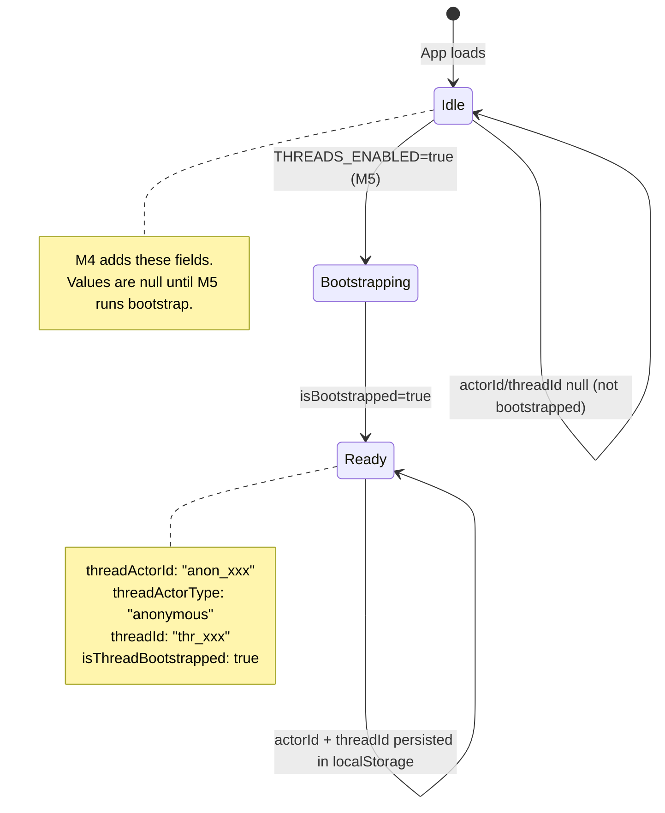

# M4 — Frontend API Client + Store Identity Slice

> **Status:** `VERIFIED`
> **Branch:** single implementation branch
> **Repos affected:** `nitrochat`
> **Estimated effort:** 1.5h
> **Risk level:** Low — purely additive; no existing behavior removed

---

## Objective

Create the typed TypeScript API client for all 4 thread endpoints and extend the Zustand store with an identity/thread slice. Nothing in this milestone calls the API client or changes the chat flow. The frontend continues to behave exactly as before — the new code is added but not yet wired into any component.

**Success criteria:** App compiles without TypeScript errors, new store fields appear in localStorage, existing chat works unchanged, and the API client module is importable.

---

## Scope

| File | Change |
|---|---|
| `lib/threads-api.ts` | New — typed fetch wrappers for 4 endpoints |
| `lib/store.ts` | Modify — ADD 4 identity fields to persisted slice; existing slices untouched |

---

## Dependencies

- **M0** — `NEXT_PUBLIC_THREADS_ENABLED` env var and `NITROCHAT_GATEWAY_URL` available
- **M3** — gateway routes running (needed for integration, not for this milestone itself)

---

## Impacted Areas

- `lib/threads-api.ts` — new module, no existing imports changed
- `lib/store.ts` — new fields only; existing `messagesByUrlPrompt`, `messages`, all other slices remain

---

## Environment Changes

```bash
# nitrochat .env.local — ensure these are set
NEXT_PUBLIC_THREADS_ENABLED=false      # still false — client exists but is not called
NITROCHAT_GATEWAY_URL=http://localhost:8080
NITROCHAT_API_KEY=<your-nitrochat-api-key>
```

> `NITROCHAT_API_KEY` is used by the existing `/api/chat` proxy route. The threads API client will use the same key via a Next.js API proxy (see implementation notes below).

---

## API Client Design

### Proxy pattern (recommended)

The threads API client calls **Next.js API proxy routes** rather than the gateway directly from the browser. This keeps the API key server-side.

```
Browser → Next.js API Route (/api/threads/*) → Gateway (/v1/nitrochat/*)
```

This mirrors the existing `/api/chat` → gateway pattern already in the codebase.

### Alternative: Direct gateway calls

If the gateway is accessible from the browser (CORS configured), direct calls from `threads-api.ts` are also valid. Document the chosen approach in `threads-api.ts`.

---

## Step-by-Step Implementation Tasks

### 1. Create `lib/threads-api.ts`

```typescript
/**
 * threads-api.ts
 *
 * Typed client for NitroChat thread persistence API.
 * All calls route through /api/threads/* Next.js proxy routes to keep
 * the gateway API key server-side.
 *
 * Calls are only made when NEXT_PUBLIC_THREADS_ENABLED === 'true'.
 */

export interface ResolveActorResponse {
  actorId: string;
  actorType: 'anonymous' | 'external' | 'authenticated';
}

export interface ResolveThreadResponse {
  threadId: string;
  actorId: string;
  actorType: 'anonymous' | 'external' | 'authenticated';
}

export interface ThreadMessage {
  messageId: string;
  threadId: string;
  actorId: string;
  role: 'user' | 'assistant' | 'tool';
  content: string;
  createdAt: string;
  metadata: string;
}

export interface PostMessageRequest {
  actorId: string;
  role: 'user' | 'assistant' | 'tool';
  content: string;
  messageId: string;
  metadata?: string;
}

// ─── Internal helpers ───────────────────────────────────────────────────────

const THREADS_BASE = '/api/threads';

async function apiFetch<T>(path: string, init?: RequestInit): Promise<T> {
  const res = await fetch(`${THREADS_BASE}${path}`, {
    headers: { 'Content-Type': 'application/json' },
    ...init,
  });
  if (!res.ok) {
    const body = await res.text();
    throw new Error(`threads-api ${init?.method ?? 'GET'} ${path} → ${res.status}: ${body}`);
  }
  return res.json() as Promise<T>;
}

// ─── Public API ─────────────────────────────────────────────────────────────

/**
 * Resolve or generate an actor identity.
 * Pass actorId to restore an existing anonymous actor.
 * Pass externalUserId to resolve an external actor.
 */
export async function resolveActor(params: {
  actorId?: string | null;
  externalUserId?: string | null;
}): Promise<ResolveActorResponse> {
  return apiFetch<ResolveActorResponse>('/actor/resolve', {
    method: 'POST',
    body: JSON.stringify({
      actorId: params.actorId ?? undefined,
      externalUserId: params.externalUserId ?? undefined,
    }),
  });
}

/**
 * Resolve or create an active thread for the given actor.
 * Idempotent — returns the same threadId for the same actorId.
 */
export async function resolveThread(params: {
  actorId: string;
  actorType: string;
}): Promise<ResolveThreadResponse> {
  return apiFetch<ResolveThreadResponse>('/threads/resolve', {
    method: 'POST',
    body: JSON.stringify(params),
  });
}

/**
 * Fetch the message history for a thread.
 */
export async function getThreadMessages(
  threadId: string,
  options?: { limit?: number; before?: number }
): Promise<ThreadMessage[]> {
  const params = new URLSearchParams();
  if (options?.limit) params.set('limit', String(options.limit));
  if (options?.before) params.set('before', String(options.before));
  const query = params.size > 0 ? `?${params}` : '';
  const res = await apiFetch<{ messages: ThreadMessage[] }>(`/threads/${threadId}/messages${query}`);
  return res.messages ?? [];
}

/**
 * Persist a single message (user or assistant) to a thread.
 * messageId is client-generated — use crypto.randomUUID() for idempotency.
 */
export async function postThreadMessage(
  threadId: string,
  msg: PostMessageRequest
): Promise<{ messageId: string }> {
  return apiFetch<{ messageId: string }>(`/threads/${threadId}/messages`, {
    method: 'POST',
    body: JSON.stringify({ ...msg, metadata: msg.metadata ?? '{}' }),
  });
}
```

### 2. Create Next.js proxy routes

Create `app/api/threads/[...path]/route.ts`:

```typescript
import { NextRequest, NextResponse } from 'next/server';

const GATEWAY_URL = process.env.NITROCHAT_GATEWAY_URL ?? '';
const API_KEY = process.env.NITROCHAT_API_KEY ?? '';

export async function GET(req: NextRequest, { params }: { params: { path: string[] } }) {
  return proxyToGateway(req, params.path, 'GET');
}

export async function POST(req: NextRequest, { params }: { params: { path: string[] } }) {
  return proxyToGateway(req, params.path, 'POST');
}

async function proxyToGateway(req: NextRequest, pathSegments: string[], method: string) {
  const path = pathSegments.join('/');
  const search = req.nextUrl.search;
  const url = `${GATEWAY_URL}/v1/nitrochat/${path}${search}`;

  const body = method !== 'GET' ? await req.text() : undefined;

  const res = await fetch(url, {
    method,
    headers: {
      'Content-Type': 'application/json',
      'X-API-Key': API_KEY,
    },
    body,
  });

  const data = await res.text();
  return new NextResponse(data, {
    status: res.status,
    headers: { 'Content-Type': 'application/json' },
  });
}
```

### 3. Extend `lib/store.ts` — add identity fields

Locate the `persist` config and the main state interface. Add the 4 new fields to the **persisted** slice only. Do not remove anything.

```typescript
// ADD to the state interface:
threadActorId: string | null;
threadActorType: 'anonymous' | 'external' | 'authenticated' | null;
threadId: string | null;
isThreadBootstrapped: boolean;

// ADD to the initial state:
threadActorId: null,
threadActorType: null,
threadId: null,
isThreadBootstrapped: false,

// ADD setter actions:
setThreadActor: (actorId: string | null, actorType: string | null) => set({ threadActorId: actorId, threadActorType: actorType as any }),
setThreadId: (threadId: string | null) => set({ threadId }),
setThreadBootstrapped: (value: boolean) => set({ isThreadBootstrapped: value }),
```

Add these fields to the `partialize` or `storage` config so they are persisted to localStorage alongside the existing fields.

---

## Store State Diagram



---

## Validation Checklist

- [ ] `npm run dev` starts without TypeScript errors
- [ ] `lib/threads-api.ts` compiles cleanly (no TS errors)
- [ ] `app/api/threads/[...path]/route.ts` compiles cleanly
- [ ] `lib/store.ts` compiles — new fields do not break existing usages
- [ ] Open browser DevTools → Application → localStorage → `nitrochat-store` key contains `threadActorId: null`, `threadId: null`, `isThreadBootstrapped: false`
- [ ] Existing chat still sends and receives messages
- [ ] No network requests to `/api/threads/*` made (flag is `false`)
- [ ] `NEXT_PUBLIC_THREADS_ENABLED=false` → no thread API calls in Network tab

---

## Smoke Tests

```bash
# TypeScript compile check
cd nitrochat
npx tsc --noEmit

# ESLint check on new files
npx eslint lib/threads-api.ts app/api/threads/

# Start dev server and verify no runtime errors
npm run dev
# Open http://localhost:3003/?standaloneMode=true
# Open DevTools console — no errors
# Open DevTools Network — no /api/threads/* requests
# Open DevTools Application > localStorage — verify new fields present
```

---

## Edge Cases

| Scenario | Expected Behavior |
|---|---|
| `NITROCHAT_GATEWAY_URL` not set | Proxy fetch to empty string — `fetch` throws; caught and returned as 500 from API route |
| `NITROCHAT_API_KEY` not set | Requests sent without `X-API-Key` → gateway returns 401 |
| `getThreadMessages` returns empty array | `res.messages ?? []` guard prevents null reference |
| `resolveActor` called with `null` actorId | Normalized to `undefined` before JSON.stringify — omitted from request body |

---

## Temporary Debugging Instructions

```typescript
// In threads-api.ts — add temporarily to apiFetch for verbose logging:
console.debug('[threads-api]', init?.method ?? 'GET', path);

// In store.ts — add to setIsBootstrapped:
console.debug('[store] isBootstrapped ->', isBootstrapped);

// Remove all [threads-api] and [store] debug console.* in M9.
```

---

## Rollback Strategy

1. Delete `lib/threads-api.ts`
2. Delete `app/api/threads/[...path]/route.ts`
3. Remove the 4 new fields from `lib/store.ts` (`threadActorId`, `threadActorType`, `threadId`, `isThreadBootstrapped`)

Existing localStorage `nitrochat-store` will have stale keys for the 4 fields — they are ignored by Zustand on next load.

---

## Known Risks

| Risk | Likelihood | Mitigation |
|---|---|---|
| Catch-all route `[...path]` conflicts with existing API routes | Low | No existing routes under `/api/threads/` |
| Zustand persist schema version mismatch after adding fields | Low | Zustand `persist` middleware merges unknown fields gracefully; add `version` bump only if breaking change |
| `crypto.randomUUID` not available in older browsers | Low | Supported in all modern browsers; polyfill not needed for MVP |

---

## Safe Incremental Rollout Notes

- This milestone is purely additive. The API client is imported nowhere yet.
- Store fields have `null` defaults — no existing code reads these fields, so no breakage.
- `isBootstrapped: false` initial state is safe — the bootstrap logic that checks it doesn't exist until M5.
- Can be merged with `NEXT_PUBLIC_THREADS_ENABLED=false` to staging with zero user impact.

---

## Suggested Commit Checkpoints

```bash
git add app/api/threads/
git commit -m "feat(threads/proxy): add Next.js API proxy routes for thread endpoints (M4)"

git add lib/threads-api.ts
git commit -m "feat(threads/api-client): add typed threads-api.ts gateway client (M4)"

git add lib/store.ts
git commit -m "feat(threads/store): add threadActorId, threadActorType, threadId, isThreadBootstrapped to Zustand store (M4)"
```

> **Tag after validation:**
> ```bash
> git tag checkpoint/m4-fe-client
> ```

---

## TODO Checklist

```
[ ] Create lib/threads-api.ts
[ ] Implement resolveActor()
[ ] Implement resolveThread()
[ ] Implement getThreadMessages()
[ ] Implement postThreadMessage()
[ ] Create app/api/threads/[...path]/route.ts (proxy)
[ ] Implement GET proxy handler
[ ] Implement POST proxy handler
[ ] Add threadActorId to store state interface
[ ] Add threadActorType to store state interface
[ ] Add threadId to store state interface
[ ] Add isThreadBootstrapped to store state interface
[ ] Add setThreadActor, setThreadId, setThreadBootstrapped actions
[ ] Include new fields in persist config
[ ] npm run dev starts without errors
[ ] npx tsc --noEmit passes
[ ] localStorage contains new fields (null values)
[ ] Existing chat works unchanged
[ ] No /api/threads requests in Network tab
[ ] Tag checkpoint/m4-fe-client
```
