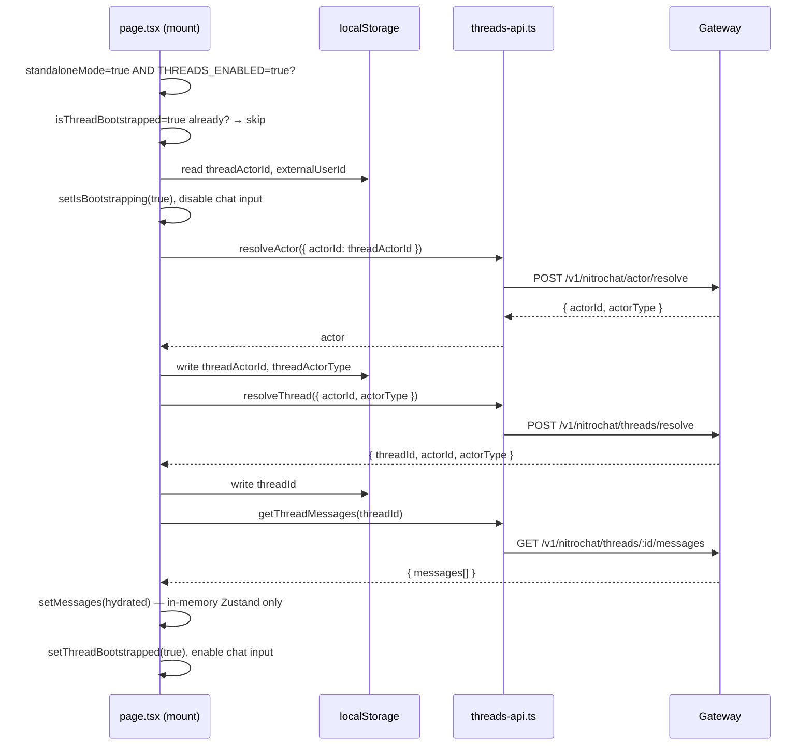
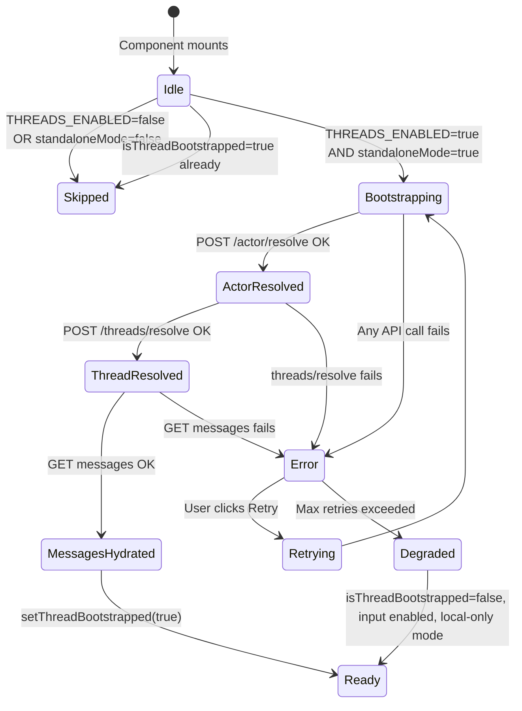

# M5 — Standalone Mode Thread Bootstrap

> **Status:** `VERIFIED`
> **Branch:** single implementation branch
> **Repos affected:** `nitrochat`
> **Estimated effort:** 3h
> **Risk level:** Medium — modifies `app/page.tsx` startup flow; gated behind feature flag

---

## Objective

Wire the full thread bootstrap lifecycle into `app/page.tsx` for standalone mode. When `NEXT_PUBLIC_THREADS_ENABLED=true` and `standaloneMode=true`, the app resolves an actor, resolves/creates a thread, and hydrates messages from the backend before the user can type. All of this is invisible when the flag is `false`.

**Success criteria:** First load creates actor + thread, hard refresh restores the same thread, messages are hydrated in order, chat input is blocked during bootstrap, and `THREADS_ENABLED=false` leaves all existing behavior intact.

---

## Scope

| File | Change |
|---|---|
| `app/page.tsx` | Modify — add bootstrap `useEffect` and loading state guard |

---

## Dependencies

- **M3** — gateway thread routes live and tested
- **M4** — `threads-api.ts` and store identity slice available

---

## Impacted Areas

- `app/page.tsx` — new `useEffect` block only; all existing effects and logic untouched
- Chat input component receives a new `disabled` prop when bootstrapping
- No changes to `app/embed/page.tsx` (that comes in M7)

---

## Environment Changes

```bash
# Enable bootstrap for local testing
NEXT_PUBLIC_THREADS_ENABLED=true
```

---

## Bootstrap Sequence



---

## Bootstrap State Machine



---

## Step-by-Step Implementation Tasks

### 1. Add bootstrap effect to `app/page.tsx`

Locate the existing `useEffect` blocks in `HomePage`. Add a new dedicated bootstrap effect:

```typescript
const THREADS_ENABLED = process.env.NEXT_PUBLIC_THREADS_ENABLED === 'true';

// Local state for bootstrap
const [isBootstrapping, setIsBootstrapping] = useState(false);
const [bootstrapError, setBootstrapError] = useState<string | null>(null);
const bootstrapLockRef = useRef(false); // prevents double-run in React StrictMode

// From store
const {
  threadActorId,
  threadActorType,
  threadId,
  isThreadBootstrapped,
  setThreadActor,
  setThreadId,
  setThreadBootstrapped,
  setMessages,
} = useChatStore();

useEffect(() => {
  const standalone = searchParams.get('standaloneMode') === 'true';
  if (!standalone || !THREADS_ENABLED) return;
  if (bootstrapLockRef.current) return;

  // Wait for Zustand rehydration so we read the persisted actorId/threadId.
  const run = () => {
    if (bootstrapLockRef.current) return;
    bootstrapLockRef.current = true;

    const storedActorId = useChatStore.getState().threadActorId;
    const urlUserId = searchParams.get('userId')?.trim() || null;

    async function runBootstrap() {
      setIsBootstrapping(true);
      setBootstrapError(null);
      try {
        const actor = await withTimeout(
          resolveActor({
            externalUserId: urlUserId ?? undefined,
            actorId: urlUserId ? undefined : (storedActorId ?? undefined),
          }),
          10_000,
          'resolveActor',
        );
        setThreadActor(actor.actorId, actor.actorType);

        const thread = await withTimeout(
          resolveThread({ actorId: actor.actorId, actorType: actor.actorType }),
          10_000,
          'resolveThread',
        );
        setThreadId(thread.threadId);

        const msgs = await getThreadMessages(thread.threadId, { limit: 50 });
        if (msgs.length > 0) {
          setMessages(mapThreadMessagesToStore(msgs));
        }

        setThreadBootstrapped(true);
      } catch (err) {
        console.error('[bootstrap] failed:', err);
        setBootstrapError('Could not restore your conversation. Check your connection and retry.');
        bootstrapLockRef.current = false;
      } finally {
        setIsBootstrapping(false);
      }
    }

    runBootstrap();
  };

  if (useChatStore.persist.hasHydrated()) {
    run();
  } else {
    const unsub = useChatStore.persist.onFinishHydration(() => {
      unsub();
      run();
    });
  }
// eslint-disable-next-line react-hooks/exhaustive-deps
}, [searchParams, bootstrapRetryCount]);
```

### 2. Add message mapping helper

```typescript
// In app/page.tsx or lib/thread-utils.ts
import { ThreadMessage } from '@/lib/threads-api';
import { ChatMessage } from '@/lib/store';

function mapThreadMessagesToStore(msgs: ThreadMessage[]): ChatMessage[] {
  return msgs.map((m) => ({
    id: m.messageId,
    role: m.role as ChatMessage['role'],
    content: m.content,
    timestamp: new Date(m.createdAt).getTime(),
  }));
}
```

### 3. Gate the chat input

Locate the `ChatInput` component usage in `app/page.tsx`. Add the `disabled` condition:

```tsx
<ChatInput
  disabled={isBootstrapping}
  placeholder={isBootstrapping ? 'Loading your conversation...' : undefined}
  // ... existing props
/>
```

### 4. Add retry UI (minimal)

```tsx
{bootstrapError && (
  <div className="p-3 text-sm text-red-400 bg-red-950/30 rounded border border-red-800 flex items-center gap-2">
    <span>{bootstrapError}</span>
    <button
      className="underline hover:no-underline"
      onClick={handleRetryBootstrap}
    >
      Retry
    </button>
  </div>
)}
```

---

## Validation Checklist

- [ ] `NEXT_PUBLIC_THREADS_ENABLED=false` → bootstrap effect never runs, chat works as before
- [ ] `NEXT_PUBLIC_THREADS_ENABLED=true`, `standaloneMode=true`:
  - [ ] 3 network requests fire on mount: actor/resolve, threads/resolve, messages
  - [ ] Chat input is disabled during bootstrap
  - [ ] `threadActorId` saved to localStorage after bootstrap
  - [ ] `threadId` saved to localStorage after bootstrap
  - [ ] Messages hydrated in correct chronological order
  - [ ] `isThreadBootstrapped=true` in Zustand after success
  - [ ] Chat input enabled after bootstrap completes
- [ ] Hard refresh:
  - [ ] Same `threadActorId` sent to actor/resolve (restored from localStorage)
  - [ ] Same `threadId` returned from threads/resolve
  - [ ] Messages re-hydrated from backend
  - [ ] `isThreadBootstrapped` resets to `false` on mount (not persisted as `true` — see below)
- [ ] Bootstrap error:
  - [ ] Error message shown with Retry button
  - [ ] Chat input becomes enabled after error (degraded local-only mode)
  - [ ] Retry button triggers fresh bootstrap
- [ ] React StrictMode double-mount: `bootstrapLockRef` prevents two parallel bootstraps

---

## `isThreadBootstrapped` Persistence Note

`isThreadBootstrapped` should **not** be persisted to localStorage. It is a session-level flag. On every fresh page load, bootstrap runs again to pull the latest messages. Add `isThreadBootstrapped` to the store's exclude list:

```typescript
// In store.ts persist config:
partialize: (state) => ({
  // ... other persisted fields
  threadActorId: state.threadActorId,
  threadActorType: state.threadActorType,
  threadId: state.threadId,
  // isThreadBootstrapped is intentionally excluded
}),
```

---

## Smoke Tests

```bash
# Enable threads
NEXT_PUBLIC_THREADS_ENABLED=true npm run dev

# Open http://localhost:3003/?standaloneMode=true

# Verify in DevTools:
# Network tab: 3 requests fire in order
#   POST /api/threads/actor/resolve
#   POST /api/threads/threads/resolve
#   GET  /api/threads/threads/<id>/messages

# Application > localStorage > nitrochat-store:
#   threadActorId: "anon_xxx..."
#   threadActorType: "anonymous"
#   threadId: "thr_xxx..."

# Hard refresh (Cmd+Shift+R):
#   Same threadActorId in actor/resolve request body
#   Same threadId returned from threads/resolve
#   No new thread created

# Send a message → check Network tab for persistence calls (added in M6)
```

---

## Edge Cases

| Scenario | Expected Behavior |
|---|---|
| Gateway unreachable on mount | Catch block shows error toast + retry button; input enabled in degraded mode |
| `actorId` in localStorage is corrupted/invalid | `resolveActor` ignores bad ID, generates new anonymous actor |
| `threadId` in localStorage but thread deleted in CH | `threads/resolve` returns new thread (no active thread found for actor) |
| React StrictMode double mount | `bootstrapLockRef.current` prevents second concurrent bootstrap |
| Multiple tabs open, same localStorage | All tabs resolve same actorId + threadId — consistent state |
| Bootstrap completes while user already typed | `setMessages` replaces in-memory store; typed content is lost (acceptable in MVP) |
| Empty message history | `getThreadMessages` returns `[]`; `setMessages([])` is safe |
| Very slow gateway (>5s) | Bootstrap waits; input remains disabled; no timeout in M5 (add in M8) |

---

## Temporary Debugging Instructions

```typescript
// In page.tsx bootstrap effect — add temporarily:
console.group('[bootstrap] starting');
console.log('actorId (stored):', actorId);
console.log('threadId (stored):', threadId);
console.groupEnd();

// After each step:
console.log('[bootstrap] actor resolved:', actor);
console.log('[bootstrap] thread resolved:', thread);
console.log('[bootstrap] messages hydrated:', msgs.length);

// Remove all [bootstrap] console.* in M9.
```

---

## Rollback Strategy

Set `NEXT_PUBLIC_THREADS_ENABLED=false` → bootstrap `useEffect` returns immediately, input is never disabled, existing behavior is fully restored.

No localStorage data is corrupted — `actorId`, `threadId`, and `null` values are inert keys that Zustand ignores when the feature is off.

---

## Known Risks

| Risk | Likelihood | Mitigation |
|---|---|---|
| Bootstrap blocks chat on slow gateway | Medium | Show spinner; enable input in degraded mode after error |
| `setMessages` overwriting user's in-progress draft | Low | Check if input is empty before hydration; in MVP this edge case is acceptable |
| Race: user sends message before bootstrap completes | Low | Input is disabled during bootstrap — impossible by design |
| `useEffect` runs before Zustand/React hydration race | Medium | Use `useChatStore.persist.hasHydrated()` check before reading `threadActorId` |

---

## Safe Incremental Rollout Notes

- The entire bootstrap block is behind `if (!standaloneMode || !THREADS_ENABLED) return` — zero impact on non-standalone mode.
- Non-standalone routes (`/embed`, regular chat) are unaffected.
- The `isBootstrapped` flag ensures bootstrap runs once per session; a refresh triggers a fresh fetch of the latest messages.

---

## Suggested Commit Checkpoints

```bash
git add app/page.tsx
git commit -m "feat(threads/bootstrap): add thread bootstrap lifecycle to standalone mode (M5)"

git add app/page.tsx
git commit -m "feat(threads/bootstrap): add loading state, retry UI, and StrictMode lock (M5)"
```

> **Tag after full validation:**
> ```bash
> git tag checkpoint/m5-standalone-bootstrap
> ```

---

## TODO Checklist

```
[ ] Add THREADS_ENABLED const to page.tsx
[ ] Add isBootstrapping local state
[ ] Add bootstrapError local state
[ ] Add bootstrapLockRef useRef
[ ] Destructure new store fields (threadActorId, threadActorType, threadId, isThreadBootstrapped, setters)
[ ] Add bootstrap useEffect with full sequence
[ ] Implement mapThreadMessagesToStore helper
[ ] Gate ChatInput with disabled={isBootstrapping}
[ ] Add bootstrap error + Retry UI
[ ] Exclude isThreadBootstrapped from persist partialize
[ ] THREADS_ENABLED=false → no effect on existing chat ✓
[ ] First load → threadActorId + threadId written to localStorage
[ ] Hard refresh → same threadId restored, no new thread ✓
[ ] Bootstrap error → retry button works
[ ] React StrictMode → no duplicate bootstrap
[ ] Multiple tabs → same thread ID in all tabs
[ ] Tag checkpoint/m5-standalone-bootstrap
```
