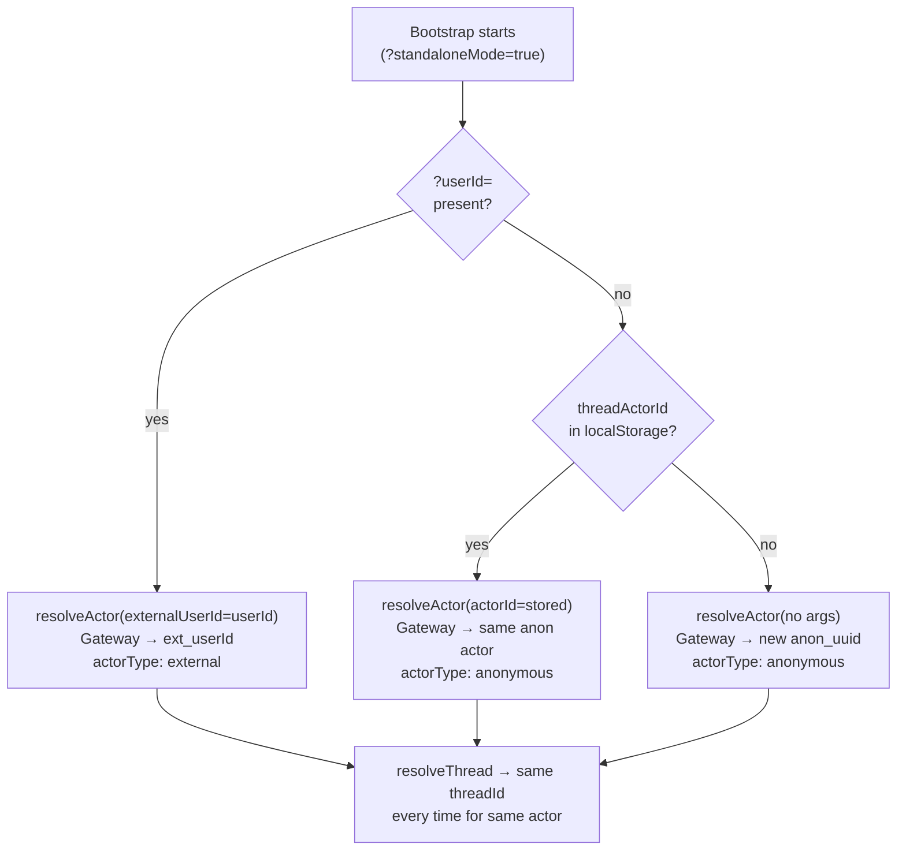

# M5b — `?userId=` Param for Standalone Thread Identity

> **Status:** `VERIFIED`
> **Branch:** single implementation branch
> **Repos affected:** `nitrochat`
> **Estimated effort:** 0.5h
> **Risk level:** Low — purely additive; absent param falls back to existing M5 anonymous flow

---

## Objective

Extend the M5 thread bootstrap to accept a `?userId=<stable-id>` query parameter in standalone mode. When present, this value is passed as `externalUserId` to `resolveActor`, producing a stable cross-device actor identity (`ext_<userId>`). When absent, the existing anonymous actor flow (M5) runs unchanged.

This covers the scenario where a parent application embeds NitroChat via `?standaloneMode=true&accessToken=<token>` without any OAuth or Zitadel auth, and wants persistent, cross-device thread continuity for their users.

**Success criteria:** Same `?userId=` on two different devices produces the same `threadId`. Absence of `?userId=` leaves M5 behavior identical to before.

---

## Scope

| File | Change |
|---|---|
| `app/page.tsx` | Modify — read `?userId=` in `runBootstrap()`, pass as `externalUserId` |

No gateway changes. The `ActorResolver` already handles `externalUserId` at priority 2.

---

## Dependencies

- **M5 COMPLETED** — bootstrap `useEffect` must exist before this add-on applies

---

## URL Contract

```
/?standaloneMode=true&accessToken=<token>&userId=<stable-id>
```

- `accessToken` — MCP Bearer auth (existing, unchanged)
- `userId` — thread identity signal (new, for persistence only)
- Both are independent — `userId` works with or without `accessToken`

`userId` accepts any alphanumeric string, hyphens, and underscores. The gateway's `ActorResolver` sanitizes the value (strips other chars, enforces 128-char max) before creating the actor ID.

---

## Actor Priority Chain



---

## Code Change

In `app/page.tsx` — inside `runBootstrap()` within the bootstrap `useEffect`:

```typescript
// Before (M5):
const storedActorId = useChatStore.getState().threadActorId;
const actor = await resolveActor({ actorId: storedActorId });

// After (M5b):
const storedActorId = useChatStore.getState().threadActorId;
const urlUserId = searchParams.get('userId')?.trim() || null;
const actor = await resolveActor({
  externalUserId: urlUserId ?? undefined,
  actorId: urlUserId ? undefined : (storedActorId ?? undefined),
});
```

When `userId` is present, `actorId` is intentionally omitted — mixing both would send conflicting identity signals to the resolver.

---

## Behaviour Matrix

| Scenario | `userId` | `storedActorId` | Result |
|---|---|---|---|
| First visit, no userId | absent | null | New `anon_<uuid>`, stored to localStorage |
| Return visit, same device | absent | `anon_xxx` | Restore `anon_xxx`, same thread |
| userId present, first visit | `alice` | null | `ext_alice`, thread created |
| userId present, return visit | `alice` | any | `ext_alice`, same thread restored |
| userId present, different device | `alice` | null | `ext_alice`, same thread as device 1 |
| userId present, incognito | `alice` | null | `ext_alice`, same thread |

---

## Auth Independence

The thread bootstrap uses `NITROCHAT_GATEWAY_API_KEY` (server-side env, injected by the Next.js proxy). It has no dependency on `?accessToken=` or OAuth status:

| Auth state | Thread bootstrap | MCP / chat |
|---|---|---|
| No `accessToken`, no OAuth | Works normally | No Bearer token to MCP server |
| `accessToken` expired | Works normally | MCP may reject (no auto-refresh for URL tokens) |
| `accessToken` valid | Works normally | Works normally |

---

## Validation Checklist

- [ ] `?standaloneMode=true&userId=alice` — Network tab shows `POST /api/threads/actor/resolve` with body `{ "externalUserId": "alice" }`
- [ ] localStorage → `threadActorId: "ext_alice"`, `threadActorType: "external"`
- [ ] Same `?userId=alice` in a different browser → same `threadId` returned
- [ ] `?standaloneMode=true` (no userId) → body is `{ "actorId": "anon_..." }` or `{}` — no `externalUserId` field
- [ ] Existing M5 anonymous flow unchanged when `?userId=` absent

---

## Smoke Tests

```bash
# Start dev server with threads enabled
NEXT_PUBLIC_THREADS_ENABLED=true npm run dev

# Test 1: userId present
# Open: http://localhost:3003/?standaloneMode=true&userId=test-user-001
# DevTools Network → POST /api/threads/actor/resolve
# Request body: { "externalUserId": "test-user-001" }
# Response: { "actorId": "ext_test-user-001", "actorType": "external" }

# Test 2: Cross-device (open in another browser or incognito)
# Open same URL → same threadId in response from /api/threads/threads/resolve

# Test 3: No userId (M5 regression)
# Open: http://localhost:3003/?standaloneMode=true
# Request body: { "actorId": "anon_..." } or {}
# No externalUserId field present
```

---

## Edge Cases

| Scenario | Expected Behavior |
|---|---|
| `userId` contains special chars (e.g. `user@email.com`) | Gateway sanitizer strips `@` and `.` → `useremailcom`. Pass pre-sanitized IDs (UUIDs, slugs) from the parent app. |
| `userId` longer than 128 chars | Gateway truncates to 128 chars — actor ID is consistent as long as the first 128 chars are the same |
| `userId` is empty string (`?userId=`) | `trim()` + `\|\| null` guard treats it as absent → falls back to anonymous |
| `userId` changes between page loads | Different actor → different thread (intentional: treat as a different user) |

---

## Rollback Strategy

Remove `userId` from the URL. Bootstrap falls back to anonymous actor (M5 behavior). No code change needed — the param is optional and its absence is a valid state.

---

## Suggested Commit Checkpoint

```bash
git add app/page.tsx
git commit -m "feat(threads/bootstrap): add ?userId= param for cross-device standalone thread identity (M5b)"
git tag checkpoint/m5b-userid-param
```
