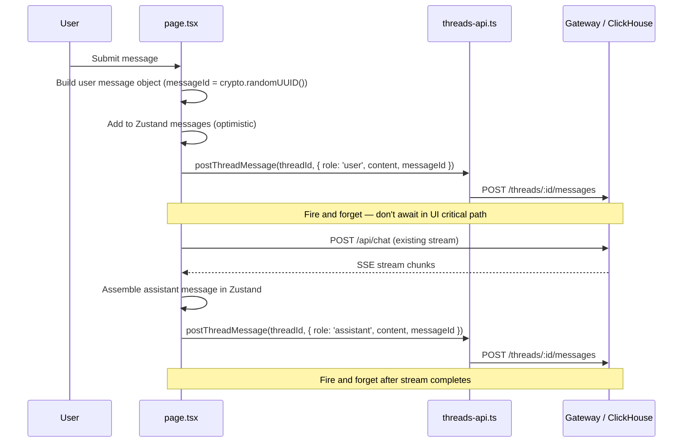
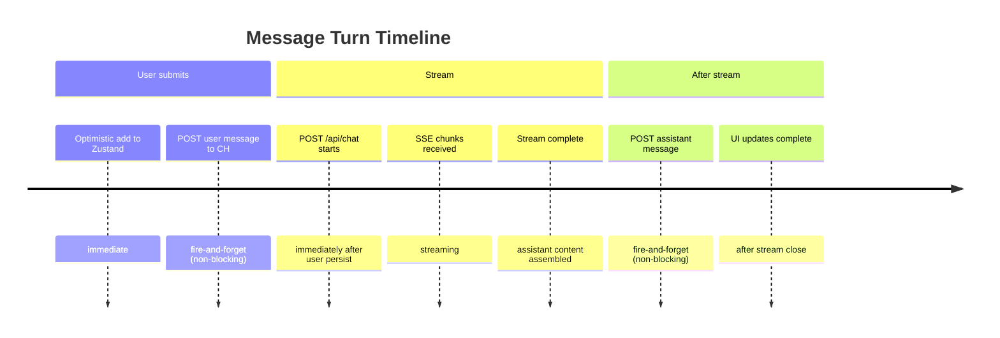

# M6 — Message Persistence During Chat

> **Status:** `VERIFIED`
> **Branch:** single implementation branch
> **Repos affected:** `nitrochat`
> **Estimated effort:** 2h
> **Risk level:** Medium — modifies the active message send flow; persistence is fire-and-forget

---

## Objective

Persist user and assistant messages to ClickHouse via the gateway during each chat turn. Persistence is fire-and-forget — a persistence failure emits a warning toast but never blocks or interrupts the chat UX.

**Success criteria:** After sending a message, both the user row and the assistant row appear in `nitrochat_thread_messages`. On page reload, the conversation is restored from the backend.

---

## Scope

| File | Change |
|---|---|
| `app/page.tsx` | Modify — add `postThreadMessage` calls before stream and after stream completion |

---

## Dependencies

- **M5** — bootstrap must be complete before any chat turn fires (thread ID must be known)

---

## Impacted Areas

- `app/page.tsx` — send message handler
- No gateway changes (M3 already handles `POST /threads/:id/messages`)
- No store changes

---

## Environment Changes

```bash
NEXT_PUBLIC_THREADS_ENABLED=true   # required for persistence calls to fire
```

---

## Persistence Flow



---

## Telemetry Contract and ClickHouse Schema Mapping

Message persistence captures rich telemetry metadata on the client, formats it in a JSON string via `buildThreadMessageMetadata`, and transmits it to the gateway where it is parsed and stored across 22 columns in `nitrochat_thread_messages`.

### 1. ClickHouse Table Schema (22 Columns)
The `nitrochat_thread_messages` table stores the following columns:
1. `thread_id` (String): The UUID of the conversation thread.
2. `actor_id` (String): The ID of the acting user/system.
3. `message_id` (String): The unique ID of the message.
4. `role` (LowCardinality(String)): The message role (`user`, `assistant`, or `tool`).
5. `content` (String): The message text.
6. `created_at` (DateTime64(3)): Precision timestamp.
7. `trace_id` (String): Distributed tracing context.
8. `request_id` (String): Unique identifier of the API request.
9. `gateway_version` (LowCardinality(String)): Version of the gateway software.
10. `deployment_version` (LowCardinality(String)): Server deployment identifier.
11. `environment` (LowCardinality(String)): Running environment (e.g., `production`).
12. `prompt_version` (String): Prompt template version.
13. `assistant_version` (String): Assistant service version.
14. `prompt_tokens` (UInt32): Input tokens.
15. `completion_tokens` (UInt32): Output tokens.
16. `reasoning_tokens` (UInt32): Reasoning-related tokens.
17. `cached_tokens` (UInt32): Tokens loaded from cache.
18. `ttft` (Float32): Time to first token in seconds.
19. `stream_duration` (Float32): Streaming duration in seconds.
20. `finish_reason` (LowCardinality(String)): LLM finish reason (e.g. `stop`).
21. `retry_count` (UInt8): Number of retries.
22. `metadata` (String): Custom client JSON payload.

### 2. Client-Side Metadata Construction
On the client, the `ThreadMessageMetadataInput` interface collects telemetry attributes before transmitting them to the gateway:
- `latencyMs` is mapped to `latency_ms` in JSON metadata.
- `promptTokens` is mapped to `prompt_tokens`.
- `completionTokens` is mapped to `completion_tokens`.
- Other parameters like `model`, `provider`, `finishReason`, `toolName`, `isMcp`, `error`, and `cost` are also encoded.

### 3. Gateway Mapping (`ApplyTelemetryFromMetadata`)
When a message is posted to the gateway, the gateway executes the `ApplyTelemetryFromMetadata` routine:
- It extracts standard fields (`trace_id`, `request_id`, `finish_reason`, etc.) from the `metadata` JSON object.
- If `stream_duration` is not explicitly set, the client-provided `latency_ms` is divided by `1000.0` and assigned to `stream_duration`.
- The gateway populates the dedicated ClickHouse columns dynamically before appending the row to the database.

---

## Step-by-Step Implementation Tasks

### 1. Locate the send message handler in `app/page.tsx`

Find the function that handles message submission (approximately named `handleSendMessage`, `sendMessage`, or `submitMessage`). It currently:
1. Builds the user message
2. Adds it to Zustand store
3. Calls `POST /api/chat` for streaming
4. Assembles the assistant response

### 2. Add user message persistence

Before or immediately after adding the user message to the Zustand store, the user message is queued for persistence using the thread persistence helpers:

```typescript
// Inside handleSendMessage in app/page.tsx
if (THREADS_ENABLED && !options?.hidden) {
  persistThreadMessageFireAndForget({
    role: 'user',
    content: userMessage.content,
    messageId: userMessage.id,
    metadata: { role: 'user', model: modelToSend },
  });
}
```

### 3. Add assistant message persistence

After the streaming response is fully assembled:

```typescript
// Inside handleSendMessage in app/page.tsx after stream completion
if (THREADS_ENABLED && data.message?.content) {
  const assistantMsgId = streamAssistantId ?? generateId();
  persistAssistantThreadMessage({
    messageId: assistantMsgId,
    content: data.message.content,
    model: modelToSend,
    latencyMs,
    streamMeta,
  });
}
```

### 4. Handle tool messages (optional, recommended)

If tool call rounds execute, the assistant message and all resulting tool message executions are persisted together:

```typescript
// Inside handleSendMessage in app/page.tsx when processed tool calls exist
if (THREADS_ENABLED) {
  const assistantMsgId = streamAssistantId ?? generateId();
  persistAssistantThreadMessage({
    messageId: assistantMsgId,
    content: processed.assistantForContinuation.content ?? data.message?.content ?? '',
    model: modelToSend,
    latencyMs,
    streamMeta,
  });
  persistToolResultThreadMessages(processed.toolResultMessages);
}
```

### 5. Generate stable messageIds

Always generate `messageId` before optimistically adding to the Zustand store, so the same ID is used for both the in-memory message and the persisted row:

```typescript
// Generate once, use everywhere
const messageId = crypto.randomUUID();
const userMsg: ChatMessage = {
  id: messageId,
  role: 'user',
  content: text,
  timestamp: Date.now(),
};
```

---

## Persistence Call Timing



---

## Validation Checklist

- [ ] `NEXT_PUBLIC_THREADS_ENABLED=false` → no `postThreadMessage` calls, chat unchanged
- [ ] `NEXT_PUBLIC_THREADS_ENABLED=true` + `standaloneMode=true`:
  - [ ] Send message → Network tab shows `POST /api/threads/threads/:id/messages` twice (user + assistant)
  - [ ] ClickHouse `nitrochat_thread_messages` has 2 new rows after turn
  - [ ] Row 1: `role=user`, correct content
  - [ ] Row 2: `role=assistant`, correct content
  - [ ] `messageId` in CH matches the ID in Zustand for both rows
  - [ ] Chat UX not blocked if persistence call is slow
  - [ ] Persistence failure (gateway down) → warning in console, chat continues
- [ ] Hard reload after sending messages → messages restored from backend (M5 hydration)
- [ ] Multi-turn conversation → all rows in CH in chronological order

---

## Smoke Tests

```bash
# After sending 2 messages in standalone mode:

# Verify row count
curl -s "http://localhost:8123/?query=SELECT+count()+FROM+nitrochat_thread_messages+WHERE+thread_id='$THREAD_ID'"
# Expected: 4 (2 user + 2 assistant)

# Verify content
curl -s "http://localhost:8123/?query=SELECT+role,content,created_at+FROM+nitrochat_thread_messages+WHERE+thread_id='$THREAD_ID'+ORDER+BY+created_at"

# Verify via API
curl -s $GW/v1/nitrochat/threads/$THREAD_ID/messages \
  -H "X-API-Key: $API_KEY" | jq '.messages[] | {role, content}'

# Reload page and verify messages appear
# Open http://localhost:3003/?standaloneMode=true
# Network tab: GET /api/threads/threads/:id/messages returns all persisted messages
```

---

## Edge Cases

| Scenario | Expected Behavior |
|---|---|
| Stream interrupted mid-response | Persist what was assembled; if content is empty string, skip persistence |
| `threadId` is null (bootstrap didn't complete) | Guards prevent persistence; log warning |
| `threadActorId` is null | Guards prevent persistence; log warning |
| Duplicate `messageId` submitted | ClickHouse MergeTree accepts both rows; `GetMessages` deduplicates on `messageId` on read |
| Very long assistant response (100k+ chars) | ClickHouse `String` is unbounded; no truncation needed |
| Tool call rounds with multiple exchanges | Each role (user/tool/assistant) is persisted as a separate row |
| Concurrent messages (not typical but possible in dev) | Each turn generates its own `messageId`; no collision |
| Gateway returns 5xx on persist POST | `.catch` swallows error; `console.warn` emitted; chat unaffected |

---

## Deduplication Note

ClickHouse `MergeTree` does not deduplicate by `message_id`. If the frontend retries a persist call (network blip), the same message may be inserted twice. On read, `GetMessages` in M9 will deduplicate by `message_id` using `GROUP BY` or `ROW_NUMBER()`. For MVP this is acceptable since fire-and-forget rarely retries.

---

## Temporary Debugging Instructions

```typescript
// In page.tsx — add temporarily around persist calls:

console.debug('[persist] persisting user message:', {
  threadId,
  messageId: userMsg.id,
  role: 'user',
  contentLength: userMsg.content.length,
});

console.debug('[persist] persisting assistant message:', {
  threadId,
  messageId: assistantMsg.id,
  role: 'assistant',
  contentLength: assistantContent.length,
});

// Remove all [persist] console.* in M9.
```

---

## Rollback Strategy

Remove the two `postThreadMessage` call blocks from the send message handler.

Existing ClickHouse rows remain (harmless). Chat UX is completely unaffected — persistence was always fire-and-forget.

---

## Known Risks

| Risk | Likelihood | Mitigation |
|---|---|---|
| Locating the exact send-message handler in `app/page.tsx` (~2600 lines) | Medium | Search for `POST /api/chat` or `consumeChatStream` — the persist calls go around those |
| Stream assembles assistant content in chunks — capturing full content | Medium | Capture in the same place existing code assembles the full response string |
| Tool call rounds increase persist call count significantly | Low | Each tool round adds 2-3 rows; acceptable at MVP scale |
| `crypto.randomUUID` not defined in server-side contexts | Low | This code runs client-side only |

---

## Safe Incremental Rollout Notes

- Fire-and-forget pattern ensures zero regression risk: if every persist call silently fails, the chat experience is 100% identical to pre-M6.
- The `THREADS_ENABLED` flag guard means this code path is a complete no-op in production until the flag is enabled.
- Rollout order: validate message persistence in dev → enable flag in staging → verify CH rows → enable in production.

---

## Suggested Commit Checkpoints

```bash
git add app/page.tsx
git commit -m "feat(threads/persist): persist user messages to ClickHouse on send (M6)"

git add app/page.tsx
git commit -m "feat(threads/persist): persist assistant messages after stream completes (M6)"
```

> **Tag after full validation (reload restores conversation):**
> ```bash
> git tag checkpoint/m6-message-persist
> ```

---

## TODO Checklist

```
[ ] Locate send message handler in app/page.tsx
[ ] Add stable messageId generation before optimistic Zustand add
[ ] Add user message postThreadMessage (fire-and-forget, .catch warning)
[ ] Add assistant message postThreadMessage after stream completion
[ ] Add tool message postThreadMessage (optional)
[ ] Guard all calls: THREADS_ENABLED && threadId && threadActorId
[ ] THREADS_ENABLED=false → no persist calls, chat unchanged ✓
[ ] Send message → 2 rows appear in CH
[ ] Persistence failure → chat continues, warning in console ✓
[ ] Hard reload → messages restored from backend ✓
[ ] Multi-turn → all rows in chronological order ✓
[ ] messageId in CH matches messageId in Zustand ✓
[ ] Tag checkpoint/m6-message-persist
```
