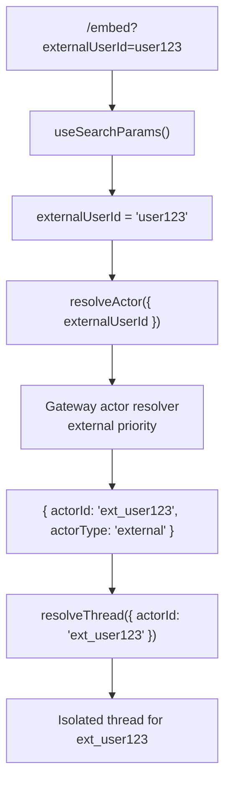
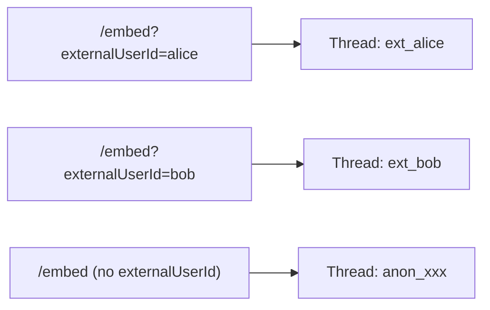

# M7 — localStorage Cleanup + Embed ExternalUserId

> **Status:** `VERIFIED`
> **Branch:** single implementation branch
> **Repos affected:** `nitrochat`
> **Estimated effort:** 1.5h
> **Risk level:** Medium — destructive change to localStorage persistence; requires M5+M6 proven stable

---

## Objective

Remove the now-redundant `messagesByUrlPrompt` localStorage persistence (messages are served from ClickHouse since M6) and wire `externalUserId` from the query param into the embed mode actor resolution. This is the only milestone that performs a destructive refactor — it must only run after M5 and M6 are validated.

**Success criteria:** `messagesByUrlPrompt` no longer written to localStorage, embed mode resolves external actors correctly, and all message history is still correctly restored from the backend.

---

## Scope

| File | Change |
|---|---|
| `lib/store.ts` | Remove `messagesByUrlPrompt`, LRU eviction, `PERSIST_MAX_*` constants from `persist` config |
| `lib/standalone-clean.ts` | Remove message-clearing logic; retain only `actorId`/`threadId` cleanup |
| `app/embed/page.tsx` | Read `externalUserId` from `useSearchParams()`, pass to `resolveActor` |

---

## Dependencies

- **M6 VERIFIED** — persistence must be confirmed working before removing localStorage messages
- **M5 VERIFIED** — bootstrap must be confirmed stable

> ⚠️ **Do not start M7 until M6 validation checklist is fully checked.**

---

## Impacted Areas

- `lib/store.ts` — removal of prompt scope persistence slice
- `lib/standalone-clean.ts` — message cleanup logic removed
- `app/embed/page.tsx` — new externalUserId wiring
- localStorage key `nitrochat-store` — `messagesByUrlPrompt` key removed on first load

---

## Environment Changes

None beyond M6. Requires `NEXT_PUBLIC_THREADS_ENABLED=true`.

---

## Embed ExternalUserId Flow



Different `externalUserId` values get completely isolated threads:



---

## localStorage State Before and After

**Before M7 (current):**
```json
{
  "nitrochat-store": {
    "threadActorId": null,
    "threadId": null,
    "messagesByUrlPrompt": {
      "__nitrochat_default__": [...messages array...]
    }
  }
}
```

**After M7:**
```json
{
  "nitrochat-store": {
    "threadActorId": "anon_f47ac10b-...",
    "threadActorType": "anonymous",
    "threadId": "thr_abc123-...",
    "messagesByUrlPrompt": // ← key gone, cleaned up on first load
  }
}
```

---

## Step-by-Step Implementation Tasks

### 1. Remove `messagesByUrlPrompt` from `lib/store.ts`

Locate and remove:
- `messagesByUrlPrompt: Record<string, ChatMessage[]>` from the state interface
- `PERSIST_MAX_MESSAGES_PER_SCOPE`, `PERSIST_MAX_SCOPES`, `URL_PROMPT_SCOPE_LRU_MAX` constants
- `normalizeScopeMessages()` helper function
- `setActiveUrlPromptScope`, `clearUrlPromptScope`, `clearAllUrlPromptConversations` actions
- LRU eviction logic in the `persist` storage write
- All references to `messagesByUrlPrompt` in the `partialize` / storage config

> ⚠️ **Before deleting:** grep all files that import or use these symbols:
> ```bash
> grep -r "messagesByUrlPrompt\|clearUrlPromptScope\|setActiveUrlPromptScope\|clearAllUrlPromptConversations\|urlPromptScopeKeyFromRaw\|PROMPT_SCOPE_DEFAULT" --include="*.ts" --include="*.tsx" nitrochat/
> ```
> Fix all usages before removing the store fields.

### 2. Update `lib/standalone-clean.ts`

The current file arms a "clean messages on refresh" mechanism. After M7, localStorage no longer holds messages, so the cleaning mechanism should:
- Retain any `threadActorId`/`threadId` cleanup logic (needed for future "start fresh" button)
- Remove logic that clears message arrays from localStorage
- Keep exports intact to avoid breaking imports

```typescript
// After M7, standalone-clean.ts behavior:
// - Does NOT clear messages (none stored in localStorage)
// - Can optionally clear actorId/threadId to force a fresh thread on next load
// - All existing exports remain (armPendingCleanOnRefresh, etc.) — may become no-ops
```

### 3. Wire `externalUserId` in `app/embed/page.tsx`

Locate the embed page bootstrap or existing `useEffect`:

```typescript
import { useSearchParams } from 'next/navigation';
import { resolveActor, resolveThread, getThreadMessages } from '@/lib/threads-api';

const searchParams = useSearchParams();
const externalUserId = searchParams.get('externalUserId');

// In bootstrap effect (similar to page.tsx but for embed):
const storedActorId = useChatStore.getState().threadActorId;
const actor = await resolveActor({
  externalUserId: externalUserId ?? undefined,
  actorId: externalUserId ? undefined : (storedActorId ?? undefined),
});
```

The embed bootstrap follows the same sequence as standalone (M5), with `externalUserId` added to the `resolveActor` call.

---

## Migration: Existing localStorage Users

Users who have conversations stored in `messagesByUrlPrompt` before M7 will:
1. On first load after M7: `messagesByUrlPrompt` key is stale in localStorage but ignored by Zustand (field removed from schema)
2. Bootstrap (M5) fetches their conversation from ClickHouse — messages appear correctly
3. After first load, `messagesByUrlPrompt` key may remain in localStorage as an orphan — harmless; browsers will eventually evict it; can be cleaned in M9

To proactively clean the stale key, add a one-time migration in the app init:

```typescript
// In app/layout.tsx or app/page.tsx (run once on first M7 load):
if (typeof window !== 'undefined') {
  try {
    const raw = localStorage.getItem('nitrochat-store');
    if (raw) {
      const parsed = JSON.parse(raw);
      if (parsed.state?.messagesByUrlPrompt !== undefined) {
        delete parsed.state.messagesByUrlPrompt;
        localStorage.setItem('nitrochat-store', JSON.stringify(parsed));
        console.debug('[migration] cleaned messagesByUrlPrompt from localStorage');
      }
    }
  } catch {}
}
```

---

## Validation Checklist

- [ ] `lib/store.ts` compiles without TypeScript errors after removals
- [ ] No remaining imports of removed symbols (grep confirms)
- [ ] `npm run dev` starts without errors
- [ ] Open `/?standaloneMode=true` → no `messagesByUrlPrompt` key in localStorage
- [ ] Existing messages still restored from backend (M5 + M6 unaffected)
- [ ] `/embed?externalUserId=user123` → actor resolved as `ext_user123`
- [ ] `/embed?externalUserId=alice` and `/embed?externalUserId=bob` → separate threads
- [ ] `/embed` (no externalUserId) → anonymous actor, own thread
- [ ] `/embed?externalUserId=<script>alert</script>` → sanitized actor ID, no injection
- [ ] Standalone mode unaffected by embed changes
- [ ] `lib/standalone-clean.ts` exports unchanged (imports don't break)

---

## Smoke Tests

```bash
# 1. Verify localStorage cleanup
# Open /?standaloneMode=true in DevTools
# Application > localStorage > nitrochat-store
# Should NOT contain messagesByUrlPrompt key

# 2. Embed with externalUserId
curl -s -X POST http://localhost:8080/v1/nitrochat/actor/resolve \
  -H "X-API-Key: $API_KEY" \
  -H "Content-Type: application/json" \
  -d '{"externalUserId":"alice"}' | jq .actorId
# Expected: "ext_alice"

# 3. Two different external users get separate threads
# Open /embed?externalUserId=alice → note threadId in localStorage
# Open /embed?externalUserId=bob (different tab) → different threadId

# 4. Verify CH isolation
curl -s "http://localhost:8123/?query=SELECT+actor_id,thread_id+FROM+nitrochat_threads+FINAL" | head -20

# 5. Old user messages still appear after cleanup
# (Requires M6 to have persisted messages before this test)
# Open /?standaloneMode=true → messages should load from CH even though localStorage is clean
```

---

## Edge Cases

| Scenario | Expected Behavior |
|---|---|
| `externalUserId` empty string in URL | `searchParams.get('externalUserId')` returns `""` → treat as null → anonymous |
| `externalUserId` changes between sessions (same browser) | New actor `ext_<newId>`, new thread created; old thread remains in CH (closed lifecycle in future) |
| User clears localStorage manually | Next load regenerates threadActorId; `threads/resolve` returns new thread; history lost (acceptable in MVP) |
| Components that still reference `urlPromptScopeKeyFromRaw` | Grep finds them; fix before removing |
| `standalone-clean.ts` consumers break after refactor | Keep all exports; make them no-ops if needed |

---

## Temporary Debugging Instructions

```typescript
// In embed/page.tsx — add temporarily:
console.debug('[embed-bootstrap] externalUserId:', externalUserId);
console.debug('[embed-bootstrap] actor resolved:', actor);

// In store.ts migration block:
console.debug('[migration] messagesByUrlPrompt cleaned from localStorage');

// Remove all [embed-bootstrap] and [migration] in M9.
```

---

## Rollback Strategy

1. **For `store.ts` removal:** Revert file to restore `messagesByUrlPrompt` and LRU logic. Users who loaded during M7 may have a stale localStorage — on rollback, `messagesByUrlPrompt` will be missing for those sessions; they see backend-restored messages (still correct).

2. **For `standalone-clean.ts`:** Revert file.

3. **For embed `externalUserId`:** Remove `externalUserId` read from `useSearchParams` and remove it from the `resolveActor` call; embed reverts to anonymous-only actors.

Data in ClickHouse is unaffected by any of these rollbacks.

---

## Known Risks

| Risk | Likelihood | Mitigation |
|---|---|---|
| Missing grep of all `messagesByUrlPrompt` usages causes TS errors | Medium | Always run full grep before removing |
| `standalone-clean.ts` consumers break | Low | Keep all exports; change implementation to no-ops if needed |
| Embed page doesn't have a bootstrap flow yet | Medium | Add embed bootstrap in the same PR as externalUserId wiring |

---

## Safe Incremental Rollout Notes

- The embed `externalUserId` wiring is purely additive — just adding one `searchParams.get()` call and passing it to `resolveActor`.
- `store.ts` cleanup is the only destructive change. It should be committed last and separately so it can be reverted independently.
- The localStorage migration shim (stale key cleanup) is a one-time no-op after first run.

---

## Suggested Commit Checkpoints

```bash
git add app/embed/page.tsx
git commit -m "feat(threads/embed): wire externalUserId into actor resolution (M7)"

git add lib/standalone-clean.ts
git commit -m "refactor(threads/clean): remove message localStorage cleanup (M7)"

git add lib/store.ts
git commit -m "refactor(threads/store): remove messagesByUrlPrompt localStorage persistence (M7)"
```

> **Tag after full validation:**
> ```bash
> git tag checkpoint/m7-storage-cleanup
> ```

---

## TODO Checklist

```
[ ] grep all usages of messagesByUrlPrompt, urlPromptScopeKeyFromRaw, PROMPT_SCOPE_DEFAULT
[ ] Fix/remove all found usages in components before store cleanup
[ ] Remove messagesByUrlPrompt from store state interface
[ ] Remove PERSIST_MAX_* constants
[ ] Remove normalizeScopeMessages helper
[ ] Remove URL prompt scope actions from store
[ ] Remove LRU eviction from persist config
[ ] Update lib/standalone-clean.ts to remove message cleanup
[ ] Keep standalone-clean.ts exports intact (no-ops if needed)
[ ] Add localStorage migration shim for stale messagesByUrlPrompt key
[ ] Add externalUserId to embed page useSearchParams
[ ] Pass externalUserId to resolveActor in embed bootstrap
[ ] Embed with externalUserId= resolves external actor ✓
[ ] Two different externalUserIds get separate threads ✓
[ ] No messagesByUrlPrompt in localStorage ✓
[ ] Messages still load from backend ✓
[ ] npx tsc --noEmit passes
[ ] Tag checkpoint/m7-storage-cleanup
```
