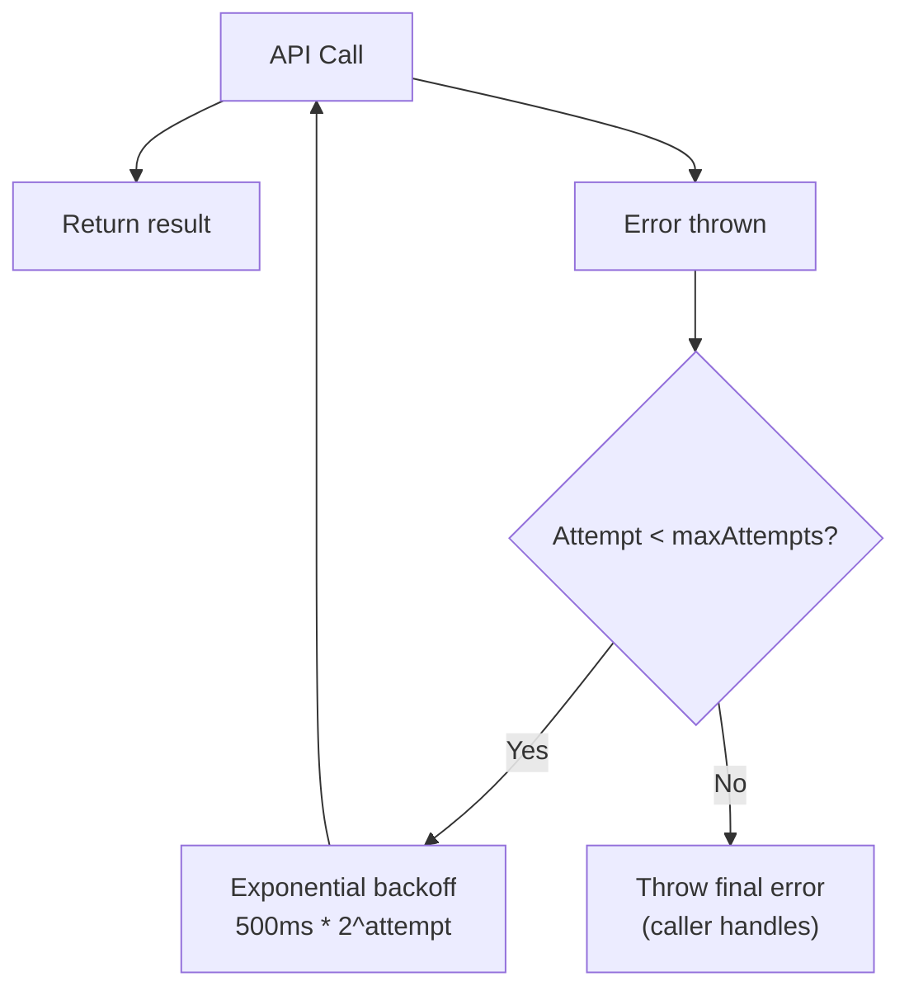
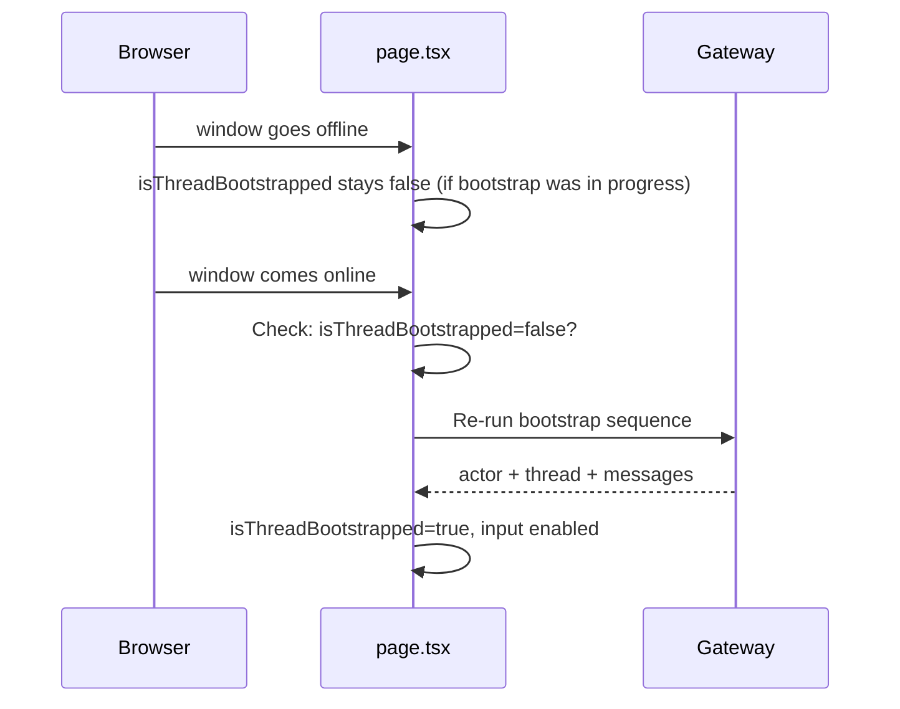
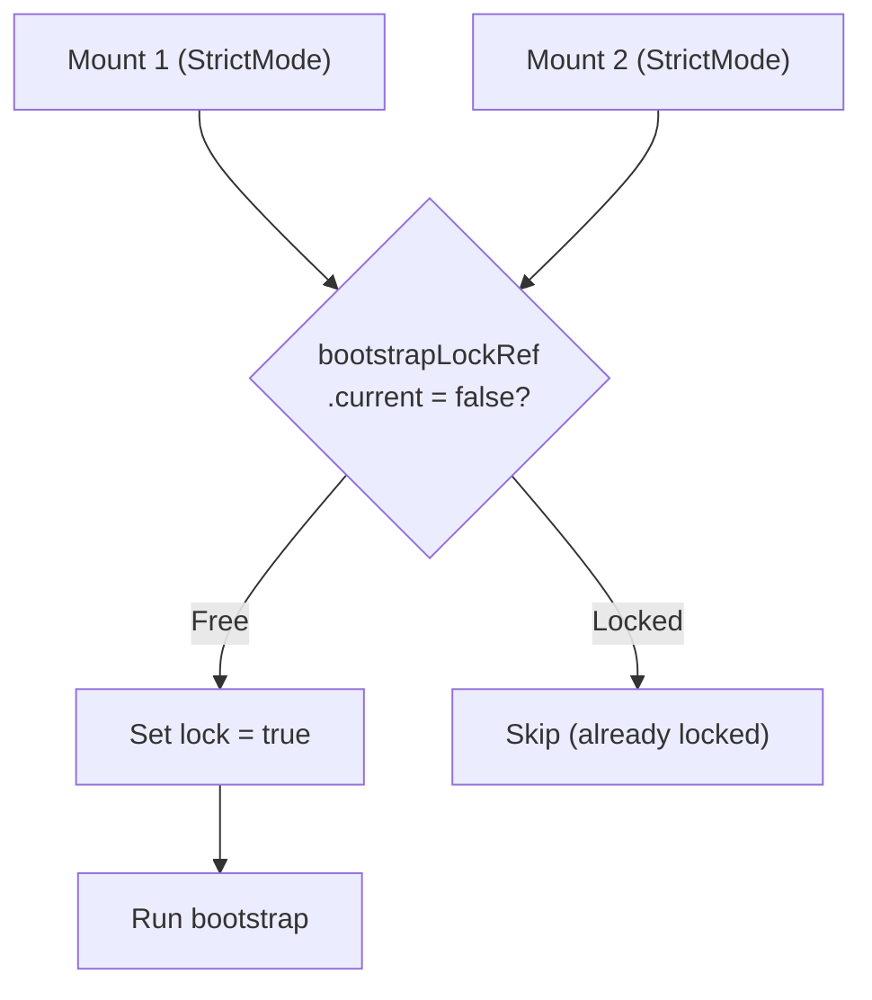

# M8 — Recovery, Retry & Reconnect Resilience

> **Status:** `VERIFIED`
> **Branch:** single implementation branch
> **Repos affected:** `nitrochat`
> **Estimated effort:** 2h
> **Risk level:** Low — additive hardening; removes no existing behavior

---

## Objective

Harden the bootstrap and persistence flows against network failures, race conditions, offline/online transitions, and edge reconnect scenarios. After this milestone, the thread system gracefully recovers from temporary gateway unavailability without user action in most cases.

**Success criteria:** Bootstrap retries automatically on transient failures, the app re-bootstraps on network reconnect, concurrent bootstrap calls are guarded, and all scenarios degrade gracefully rather than breaking the chat UI.

---

## Scope

| File | Change |
|---|---|
| `lib/threads-api.ts` | Add `withRetry` wrapper for `resolveActor` and `resolveThread` |
| `app/page.tsx` | Add `online`/`offline` event listener; strengthen bootstrap lock |

---

## Dependencies

- **M5** — bootstrap flow exists
- **M6** — persistence flow exists

---

## Impacted Areas

- `lib/threads-api.ts` — retry wrapper added to resolve calls
- `app/page.tsx` — reconnect handler added
- No gateway changes needed — idempotency already guaranteed in M3

---

## Environment Changes

None beyond M5.

---

## Retry Strategy



Retry applies only to `resolveActor` and `resolveThread` — these are idempotent and safe to retry. `postThreadMessage` is fire-and-forget and does not retry (M6 design).

---

## Reconnect Flow



---

## Race Condition Guards



---

## Step-by-Step Implementation Tasks

### 1. Add `withRetry` to `lib/threads-api.ts`

```typescript
/**
 * Retries an async function with exponential backoff.
 * Only retries on network/server errors, not on 4xx (bad requests).
 */
async function withRetry<T>(
  fn: () => Promise<T>,
  maxAttempts = 3,
  baseDelayMs = 500
): Promise<T> {
  let lastError: unknown;
  for (let attempt = 0; attempt < maxAttempts; attempt++) {
    try {
      return await fn();
    } catch (err) {
      lastError = err;
      // Don't retry on client errors (400-499)
      if (err instanceof Error && err.message.includes('→ 4')) {
        throw err;
      }
      if (attempt < maxAttempts - 1) {
        const delay = baseDelayMs * Math.pow(2, attempt);
        console.debug(`[threads-api] retry attempt ${attempt + 1}/${maxAttempts} in ${delay}ms`);
        await new Promise((res) => setTimeout(res, delay));
      }
    }
  }
  throw lastError;
}

// Apply to resolveActor and resolveThread:
export async function resolveActor(params: { ... }): Promise<ResolveActorResponse> {
  return withRetry(() => apiFetch<ResolveActorResponse>('/actor/resolve', {
    method: 'POST',
    body: JSON.stringify({ ... }),
  }));
}

export async function resolveThread(params: { ... }): Promise<ResolveThreadResponse> {
  return withRetry(() => apiFetch<ResolveThreadResponse>('/threads/resolve', {
    method: 'POST',
    body: JSON.stringify(params),
  }));
}
```

### 2. Add online/offline reconnect handler to `app/page.tsx`

```typescript
// Add to the bootstrap useEffect (or as a separate useEffect):

useEffect(() => {
  if (!THREADS_ENABLED) return;
  if (searchParams.get('standaloneMode') !== 'true') return;

  function handleOnline() {
    const bootstrapped = useChatStore.getState().isThreadBootstrapped;
    if (!bootstrapped) {
      bootstrapLockRef.current = false;
      setBootstrapRetryCount((c) => c + 1);
    }
  }

  window.addEventListener('online', handleOnline);
  return () => window.removeEventListener('online', handleOnline);
}, [searchParams]);
```

### 3. Bootstrap timeout guard

Add a timeout so bootstrap doesn't hang indefinitely on a very slow gateway:

```typescript
async function withTimeout<T>(promise: Promise<T>, ms: number, label: string): Promise<T> {
  const timeout = new Promise<never>((_, reject) =>
    setTimeout(() => reject(new Error(`[timeout] ${label} exceeded ${ms}ms`)), ms)
  );
  return Promise.race([promise, timeout]);
}

// Wrap bootstrap calls:
const actor = await withTimeout(resolveActor({ actorId }), 10_000, 'resolveActor');
const thread = await withTimeout(resolveThread({ ... }), 10_000, 'resolveThread');
```

### 4. Strengthen the bootstrap lock

The existing `bootstrapLockRef` from M5 already prevents double-mounts. Ensure it is properly released on error:

```typescript
} catch (err) {
  console.error('[bootstrap] failed:', err);
  setBootstrapError('...');
  bootstrapLockRef.current = false; // MUST release lock so retry works
} finally {
  setIsBootstrapping(false);
}
```

---

## Recovery Scenarios

### Scenario 1: Bootstrap fails on load, user clicks Retry

```
1. Mount → bootstrap starts → gateway 503 → retry 3x → all fail
2. Error toast shown with Retry button
3. bootstrapLockRef.current = false (released in catch)
4. User clicks Retry → setIsBootstrapped(false) triggers useEffect → bootstrap re-runs
5. Bootstrap succeeds → chat available
```

### Scenario 2: Page loads offline

```
1. Mount → THREADS_ENABLED=true → bootstrap starts
2. All fetch calls fail (offline)
3. withRetry exhausted → error shown, input enabled (degraded)
4. User goes online → window 'online' event → re-bootstrap
5. Bootstrap succeeds → messages loaded
```

### Scenario 3: Gateway restarts mid-session

```
1. User is chatting → gateway restarts (messages in progress may fail persist)
2. User sends next message → /api/chat still works (gateway restarted)
3. postThreadMessage calls fail → .catch warning only, chat unaffected
4. On next page reload → bootstrap succeeds, latest persisted messages hydrated
```

### Scenario 4: React StrictMode double-mount

```
1. Development: useEffect fires twice in quick succession
2. First call: bootstrapLockRef.current = false → sets to true → bootstrap starts
3. Second call: bootstrapLockRef.current = true → returns early
4. Bootstrap runs exactly once
```

---

## Concurrency Test

```bash
# Simulate concurrent /threads/resolve calls for the same actor
for i in {1..5}; do
  curl -s -X POST $GW/v1/nitrochat/threads/resolve \
    -H "X-API-Key: $API_KEY" \
    -H "Content-Type: application/json" \
    -d "{\"actorId\":\"anon_f47ac10b-58cc-4372-a567-0e02b2c3d479\",\"actorType\":\"anonymous\"}" &
done
wait

# All 5 responses should have the same threadId
# Verify: SELECT count(DISTINCT thread_id) FROM nitrochat_threads FINAL WHERE actor_id='anon_...' AND status='active'
# Expected: 1
```

---

## Validation Checklist

- [ ] `resolveActor` retries up to 3 times on 5xx/network error
- [ ] `resolveThread` retries up to 3 times on 5xx/network error
- [ ] `resolveActor` does NOT retry on 4xx (bad request)
- [ ] Retry delay: 500ms → 1s → 2s (exponential)
- [ ] Bootstrap timeout: gateway >10s → timeout error shown
- [ ] `window.online` event → bootstrap re-runs if `isThreadBootstrapped=false`
- [ ] `window.online` event → bootstrap does NOT re-run if `isThreadBootstrapped=true`
- [ ] Retry button → bootstrap re-runs successfully
- [ ] React StrictMode double-mount → bootstrap runs exactly once
- [ ] 5 concurrent `/threads/resolve` calls → same threadId returned by all
- [ ] Gateway restart mid-session → next persist call succeeds, no message loss

---

## Smoke Tests

```bash
# 1. Test retry: start gateway, begin bootstrap, stop gateway
#    → watch console for [threads-api] retry attempt logs
#    → restart gateway → bootstrap succeeds on retry

# 2. Test offline/online:
#    DevTools > Network > Offline
#    Refresh page → bootstrap fails after retries → error shown
#    DevTools > Network > Online
#    → browser 'online' event fires → bootstrap retries → succeeds

# 3. Test concurrency (from terminal):
for i in {1..5}; do
  curl -s -X POST $GW/v1/nitrochat/threads/resolve \
    -H "X-API-Key: $API_KEY" \
    -H "Content-Type: application/json" \
    -d '{"actorId":"anon_f47ac10b-58cc-4372-a567-0e02b2c3d479","actorType":"anonymous"}' | jq -r .threadId &
done
wait
# All outputs should be identical
```

---

## Edge Cases

| Scenario | Expected Behavior |
|---|---|
| Gateway consistently down for >30s | 3 retries exhausted; error shown; degraded local-only mode |
| `window.online` fires but gateway still down | Re-bootstrap runs; fails again; error stays visible |
| `resolveActor` succeeds but `resolveThread` fails all 3 retries | Partial state: actorId saved, threadId not saved; error shown |
| User navigates away mid-bootstrap | useEffect cleanup fires; bootstrap promise resolves/rejects silently |
| Two tabs simultaneously bootstrap same actorId | Both resolve same threadId (idempotent gateway); no race |

---

## Temporary Debugging Instructions

```typescript
// In threads-api.ts withRetry:
console.debug(`[threads-api] retry attempt ${attempt + 1}/${maxAttempts} after ${delay}ms`);

// In page.tsx online handler:
console.debug('[reconnect] network online, isThreadBootstrapped:', isThreadBootstrapped);

// In page.tsx timeout wrapper:
console.debug('[bootstrap-timeout] set for', ms, 'ms');

// Remove all in M9.
```

---

## Rollback Strategy

Remove `withRetry` wrapper from `resolveActor` and `resolveThread` in `threads-api.ts` (restore to direct `apiFetch` calls). Remove `window.online` event listener from `page.tsx`. Remove `withTimeout` calls.

Bootstrap still functions correctly — just less resilient. Zero regression risk.

---

## Known Risks

| Risk | Likelihood | Mitigation |
|---|---|---|
| `withRetry` adds 500ms+ latency on partial failure | Low | Only retries on errors; success path has zero overhead |
| Reconnect handler fires too aggressively | Low | Only re-bootstraps when `isThreadBootstrapped=false` — won't interrupt active sessions |
| `Promise.race` with timeout resolves the timeout but leaves the original promise dangling | Low | Original promise is garbage collected after timeout; no memory leak in practice |

---

## Safe Incremental Rollout Notes

- Retry logic is transparent — success path is unchanged.
- The reconnect handler is purely additive — does nothing if already bootstrapped.
- Can be deployed while `NEXT_PUBLIC_THREADS_ENABLED=true` without any user-visible change on normal load paths.

---

## Suggested Commit Checkpoints

```bash
git add lib/threads-api.ts
git commit -m "feat(threads/resilience): add withRetry and withTimeout to thread API client (M8)"

git add app/page.tsx
git commit -m "feat(threads/resilience): add online/offline reconnect bootstrap handler (M8)"
```

> **Tag after validation:**
> ```bash
> git tag checkpoint/m8-recovery
> ```

---

## TODO Checklist

```
[ ] Add withRetry() helper to lib/threads-api.ts
[ ] Apply withRetry to resolveActor()
[ ] Apply withRetry to resolveThread()
[ ] Verify withRetry does NOT retry 4xx responses
[ ] Add withTimeout() helper
[ ] Apply withTimeout to resolveActor and resolveThread calls in bootstrap
[ ] Add window.online event listener in page.tsx
[ ] Guard reconnect: only re-bootstrap if isThreadBootstrapped=false
[ ] Ensure bootstrapLockRef released in catch (check M5 implementation)
[ ] Retry: 500ms → 1s → 2s delays verified in console
[ ] Bootstrap timeout: 10s fires correctly
[ ] window.online triggers re-bootstrap when not yet bootstrapped ✓
[ ] window.online does NOT re-bootstrap when already bootstrapped ✓
[ ] Concurrent /threads/resolve → same threadId all 5 calls ✓
[ ] Retry button re-runs bootstrap successfully ✓
[ ] Tag checkpoint/m8-recovery
```
