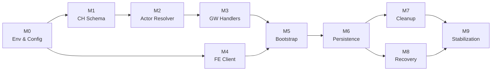
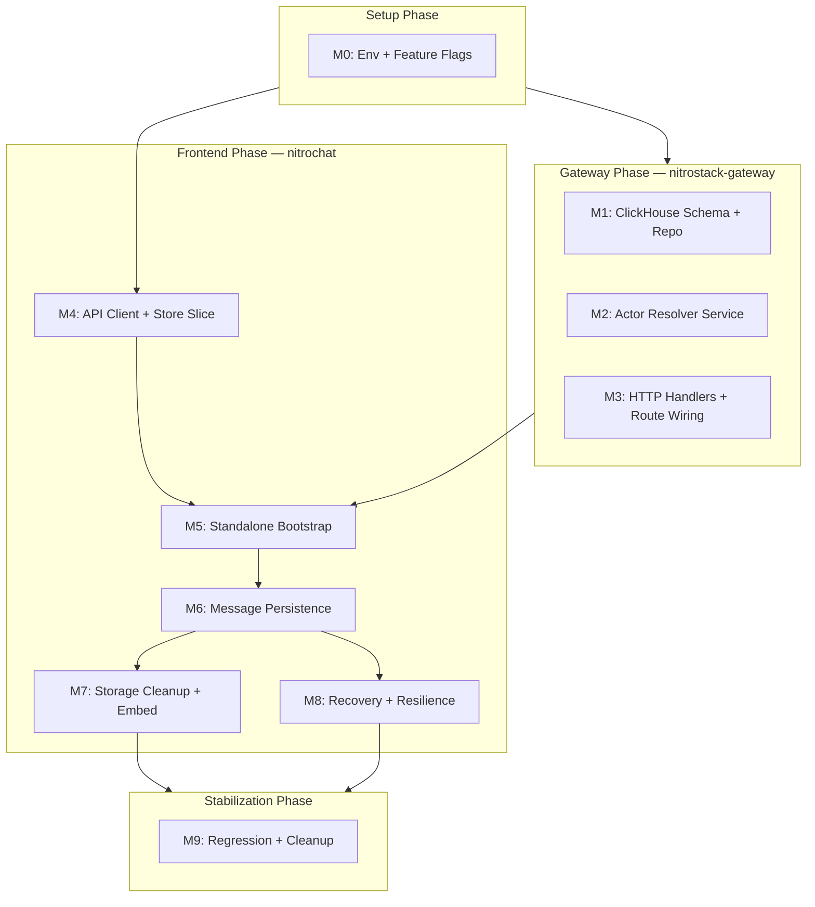
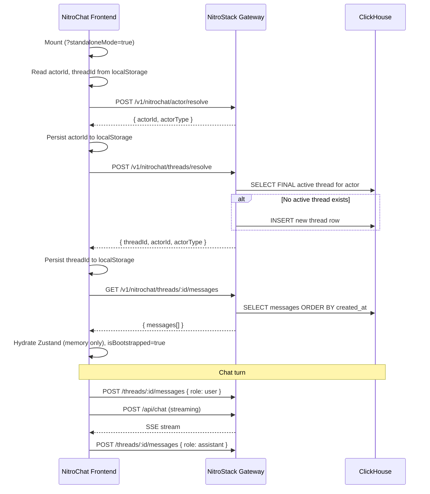
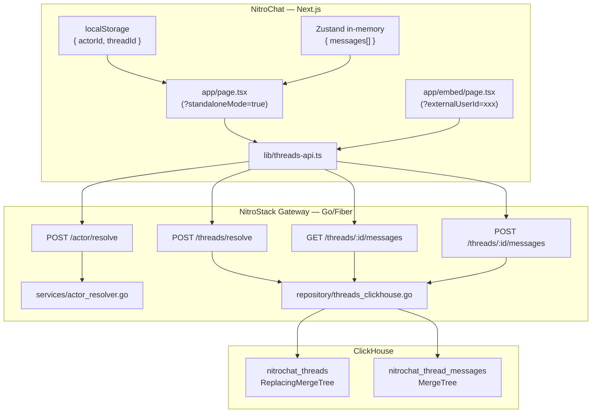
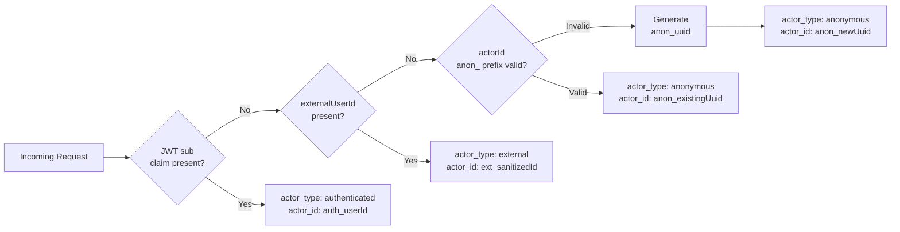

# NitroChat Threads — Implementation Index

> **Branch policy:** All work happens inside a **single implementation branch**. No multi-branch workflows.
> **Engine:** ClickHouse-only persistence. No traditional database for thread data.

---

## Status Legend

| Label | Meaning |
|---|---|
| `NOT_STARTED` | Work has not begun |
| `IN_PROGRESS` | Actively being developed |
| `BLOCKED` | Waiting on a dependency or decision |
| `COMPLETED` | Implementation done, not yet verified |
| `VERIFIED` | Smoke tested and validation checklist passed |

---

## Milestone Index

| # | File | Title | Repo(s) | Status |
|---|---|---|---|---|
| M0 | [00-environment-and-config.md](./00-environment-and-config.md) | Environment & Feature Flag Foundation | gateway + frontend | `VERIFIED` |
| M1 | [01-clickhouse-schema-and-repository.md](./01-clickhouse-schema-and-repository.md) | ClickHouse Schema + Repository Layer | gateway | `VERIFIED` |
| M2 | [02-actor-resolution-service.md](./02-actor-resolution-service.md) | Actor Resolution Service | gateway | `VERIFIED` |
| M3 | [03-gateway-thread-handlers.md](./03-gateway-thread-handlers.md) | Gateway Thread HTTP Handlers | gateway | `VERIFIED` |
| M3b | [03b-resolve-thread-race-fix.md](./03b-resolve-thread-race-fix.md) | ResolveThread Concurrent Race Fix | gateway | `VERIFIED` |
| M4 | [04-frontend-api-client-and-store.md](./04-frontend-api-client-and-store.md) | Frontend API Client + Store Identity Slice | frontend | `VERIFIED` |
| M5 | [05-standalone-thread-bootstrap.md](./05-standalone-thread-bootstrap.md) | Standalone Mode Thread Bootstrap | frontend | `VERIFIED` |
| M5b | [05b-userid-param-standalone.md](./05b-userid-param-standalone.md) | `?userId=` Param for Cross-Device Thread Identity | frontend | `VERIFIED` |
| M6 | [06-message-persistence.md](./06-message-persistence.md) | Message Persistence During Chat | frontend | `VERIFIED` |
| M7 | [07-storage-cleanup-and-embed.md](./07-storage-cleanup-and-embed.md) | localStorage Cleanup + Embed ExternalUserId | frontend | `VERIFIED` |
| M8 | [08-recovery-and-resilience.md](./08-recovery-and-resilience.md) | Recovery, Retry & Reconnect Resilience | frontend | `VERIFIED` |
| M9 | [09-stabilization-and-regression.md](./09-stabilization-and-regression.md) | Stabilization, Cleanup & Regression | gateway + frontend | `VERIFIED` |

---

## Dependency Order



### Parallelizable tracks (after M0)

```
Gateway track:  M1 → M2 → M3   (pure Go — no frontend dependency)
Frontend track: M4              (pure TypeScript — client written but not yet invoked)
```

Both tracks converge at **M5**.

---

## Implementation Flow



---

## End-to-End Thread Lifecycle



---

## System Architecture



---

## Actor Model



---

## Testing Flow

### Backend (nitrostack-gateway)
1. Unit test `actor_resolver.go` in isolation (M2)
2. `curl` smoke tests against running gateway (M3)
3. ClickHouse row verification after each operation (M3)
4. Idempotency tests: call `/threads/resolve` 5x → same threadId (M3)
5. Concurrent actor resolution test (M8)

### Frontend (nitrochat)
1. TypeScript compile check after each store change (M4)
2. Manual browser test: localStorage inspection (M5)
3. Network tab verification: 3 bootstrap requests fire in order (M5)
4. Hard refresh: messages restored from backend (M6)
5. Offline/online reconnect simulation (M8)
6. Embed mode with/without `externalUserId` (M7)

### Integration
1. Full end-to-end: send message → reload → verify restored (M6)
2. Embed flow: `/embed?externalUserId=u123` → own thread (M7)
3. Regression: all existing chat features work with `THREADS_ENABLED=false` (M9)

---

## Rollback Strategy Overview

Every milestone uses additive patterns before destructive ones:

| Milestone | Rollback Method | Data Impact |
|---|---|---|
| M0 | Remove env vars | None |
| M1 | `DROP TABLE` 2 tables; revert `initSchema` | None (tables empty) |
| M2 | Delete `actor_resolver.go` | None (no routes wired) |
| M3 | Set `THREADS_ENABLED=false` | None (routes not registered) |
| M4 | Delete `threads-api.ts`; revert 4 store fields | None (not called yet) |
| M5 | Set `NEXT_PUBLIC_THREADS_ENABLED=false` | None (existing chat unaffected) |
| M6 | Remove 2 `postThreadMessage` calls | Rows stay in CH (harmless) |
| M7 | Revert `store.ts` LRU removal | Users see backend-restored history |
| M8 | Remove retry wrappers | Less resilient, still functional |
| M9 | N/A — cleanup only | None |

---

## Checkpoint Tags

| Milestone | Tag |
|---|---|
| M0 | `checkpoint/m0-env-ready` |
| M1 | `checkpoint/m1-schema-ready` |
| M2 | `checkpoint/m2-actor-resolver` |
| M3 | `checkpoint/m3-gateway-routes` |
| M4 | `checkpoint/m4-fe-client` |
| M5 | `checkpoint/m5-standalone-bootstrap` |
| M6 | `checkpoint/m6-message-persist` |
| M7 | `checkpoint/m7-storage-cleanup` |
| M8 | `checkpoint/m8-recovery` |
| M9 | `checkpoint/m9-stable` |
| Final | `release/threads-mvp` |

---

## Current Status Tracking

> Update this section as milestones progress.

```
M0  Environment & Config         [x] VERIFIED
M1  ClickHouse Schema + Repo     [x] VERIFIED
M2  Actor Resolution Service     [x] VERIFIED
M3  Gateway Thread Handlers      [x] VERIFIED
M3b ResolveThread Race Fix       [x] VERIFIED
M4  Frontend Client + Store      [x] VERIFIED
M5  Standalone Bootstrap         [x] VERIFIED
M5b ?userId= Param               [x] VERIFIED
M6  Message Persistence          [x] VERIFIED
M7  Storage Cleanup + Embed      [x] VERIFIED
M8  Recovery & Resilience        [x] VERIFIED
M9  Stabilization & Regression   [x] VERIFIED
```

---

## Folder Structure

```
nitrochat/docs/threads/
├── README.md                               ← this file (master index)
├── standards.md                            ← documentation standards + naming conventions
├── 00-environment-and-config.md
├── 01-clickhouse-schema-and-repository.md
├── 02-actor-resolution-service.md
├── 03-gateway-thread-handlers.md
├── 04-frontend-api-client-and-store.md
├── 05-standalone-thread-bootstrap.md
├── 06-message-persistence.md
├── 07-storage-cleanup-and-embed.md
├── 08-recovery-and-resilience.md
└── 09-stabilization-and-regression.md
```

---

*See [standards.md](./standards.md) for documentation conventions, status labels, and guidance on adding future milestones.*
