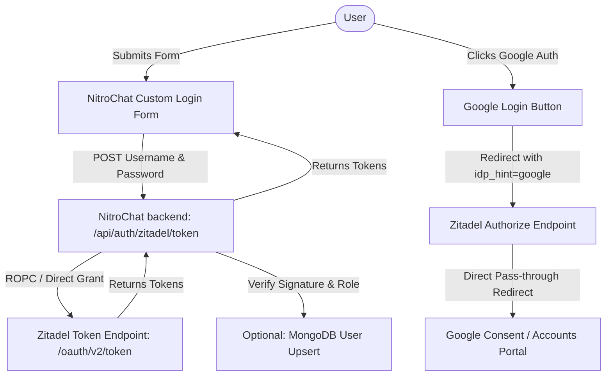

# Technical Plan: API-Only & Hybrid Zitadel Login in NitroChat

This plan outlines the architecture, backend changes, and frontend modifications required to bypass the official Zitadel login page completely, providing a fully native sign-in experience inside **NitroChat**.

---

## 1. Architectural Strategy

To support both standard username/password logins and social SSO (Google/GitHub) without exposing the native Zitadel portal UI:

1. **Username & Password (API-Only Direct Grant)**:
   * NitroChat hosts a native login form.
   * Credentials (username/password) are POSTed to the NitroChat backend.
   * The backend performs a secure **Resource Owner Password Credentials (ROPC)** / Direct Grant exchange directly with Zitadel's `/oauth/v2/token` endpoint.
   * Cryptographic verification (JWKS) and project-role authorization checks are run backend-to-backend before tokens are returned to the client.
2. **Google & GitHub SSO (Bypassed Redirects via IdP Hinting)**:
   * NitroChat displays "Sign in with Google" and "Sign in with GitHub" buttons.
   * Clicking a button initiates a standard OIDC redirect but appends the `idp_hint` parameter (e.g. `idp_hint=google`).
   * Zitadel intercepts the request, bypasses its login selector screen, and routes the browser directly to Google/GitHub.
   * Upon successful authorization, the user is redirected back to NitroChat's callback, maintaining a native-like transition.



---

## 2. Prerequisites & Zitadel Configuration

Before code modifications are deployed, the OIDC Client configuration for the NitroChat tenant in Zitadel must be updated:
1. **Enable Password Grant**: The application configuration in Zitadel must allow the `Resource Owner Password` grant type (currently only `Authorization Code` and `Refresh Token` might be enabled).
2. **Authentication Policies**: Ensure that the organization's login policy allows username/password login alongside external identity providers (Google/GitHub).

---

## 3. Proposed Code Changes

### A. Backend: Supporting Direct Grant in Token Exchange
Modify the existing token exchange route at [app/api/auth/zitadel/token/route.ts](file:///Users/admin/Desktop/imp/zitadel/nitrochat/app/api/auth/zitadel/token/route.ts) to handle both `authorization_code` exchanges and `password` credentials exchanges.

#### Modified Endpoint Logic Design:
```typescript
// Proposed request body interface
interface ZitadelTokenRequest {
  // Authorization Code Path
  code?: string;
  codeVerifier?: string;
  
  // Direct Grant Path (New)
  username?: string;
  password?: string;
}
```

* **When `username` and `password` are present**:
  1. Set up the payload to hit Zitadel's `/oauth/v2/token` using standard HTTP Basic or client parameters:
     ```
     grant_type=password
     username=<username>
     password=<password>
     scope=openid profile email offline_access urn:zitadel:iam:org:project:id:<projectId>:aud urn:zitadel:iam:org:projects:roles
     client_id=<clientId>
     client_secret=<clientSecret>
     ```
  2. Send a POST request to `${issuer}/oauth/v2/token` with the `application/x-www-form-urlencoded` body.
  3. Validate the signature of the returned access token via JWKS.
  4. Enforce project role validation using `checkAccessTokenProjectRoles`.
  5. Upsert the user profile in MongoDB if enabled, and return tokens to the client.

---

### B. Frontend: Login Form Implementation

#### 1. Custom UI Form Component
Modify or create a custom sign-in component to house the username and password fields. This can be integrated into the existing [ZitadelLoginModal.tsx](file:///Users/admin/Desktop/imp/zitadel/nitrochat/components/ZitadelLoginModal.tsx).

* **New States**: Add `username`, `password`, `isLoggingIn`, and `authError`.
* **Form Inputs**: Render standard input fields for Username (or Email) and Password.
* **Submit Action**: Calls the login function passing the credentials.

#### 2. Authentication Hook
Extend the login handlers inside [app/page.tsx](file:///Users/admin/Desktop/imp/zitadel/nitrochat/app/page.tsx) to execute the direct token exchange:

```typescript
const handleDirectZitadelLogin = async (username, password) => {
  setIsLoading(true);
  try {
    const res = await fetch('/api/auth/zitadel/token', {
      method: 'POST',
      headers: { 'Content-Type': 'application/json' },
      body: JSON.stringify({ username, password })
    });
    
    const data = await res.json();
    if (res.ok && data.accessToken) {
      saveZitadelTokens({
        accessToken: data.accessToken,
        refreshToken: data.refreshToken,
        expiresAt: data.expiresAt,
        tokenType: data.tokenType || 'Bearer',
      });
      setZitadelTokens({
        accessToken: data.accessToken,
        refreshToken: data.refreshToken,
        expiresAt: data.expiresAt,
      });
      // Establish MCP connection
      await connectMcpClient(data.accessToken);
    } else {
      setZitadelSignInError(data.error || 'Authentication failed');
    }
  } catch (err) {
    setZitadelSignInError('Network error. Please try again.');
  } finally {
    setIsLoading(false);
  }
};
```

---

### C. Redirect Flow: IdP Hinting for Social SSO
The existing `/api/auth/zitadel/login` endpoint already supports generating the authorization URL. 

To support seamless Google/GitHub login:
1. **Google Button Action**:
   * Calls `POST /api/auth/zitadel/login` with body `{ idpHint: 'google' }`.
   * Endpoint returns the `authorizationUrl` containing `&idp_hint=google`.
   * Frontend redirects the browser: `window.location.href = authorizationUrl`.
2. **GitHub Button Action**:
   * Calls `POST /api/auth/zitadel/login` with body `{ idpHint: 'github' }`.
   * Endpoint returns the `authorizationUrl` containing `&idp_hint=github`.
   * Frontend redirects the browser.

---

## 4. Verification & Testing Plan

### A. Automated Token Tests
* **Verify Direct Grant**: Run a mock curl command or testing script to hit `/api/auth/zitadel/token` directly using credentials to verify that it successfully returns access tokens, parses JWKS signatures, and enforces roles.
* **Verify Role Rejection**: Verify that if a user authenticates with correct credentials but lacks the configured role in the Zitadel project, the endpoint successfully rejects with `403 Forbidden`.

### B. Manual Verification
1. **Direct Password Login**:
   * Open the custom login modal in NitroChat.
   * Enter test user credentials.
   * Verify that authentication completes, the modal closes, and the chat interface initializes without hitting any redirect pages.
2. **IdP Hint Redirect**:
   * Click "Sign in with Google" / "Sign in with GitHub".
   * Ensure that the browser goes directly to Google/GitHub's official consent interface (bypassing the Zitadel selection prompt).
   * Complete the login and verify that the callback lands the user back in NitroChat fully authenticated.
