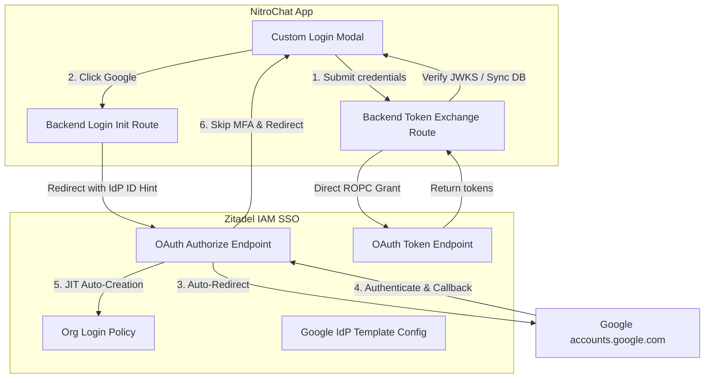

# Integration Report: Zitadel Direct Login & Google SSO Bypass

This document details the technical achievements, configuration changes, and implementation mapping applied to **NitroChat** to support the Hybrid / API-Only authentication flow with Zitadel, bypassing all hosted portal selector UIs, JIT registration screens, and MFA setup prompts.

---

## 1. Architectural Overview

To deliver a fully native sign-in experience inside NitroChat, we resolved three distinct challenges during the OIDC integration:

1. **Direct Credentials Login (API-Only)**: Exchanging local username/passwords via direct Resource Owner Password Credentials (ROPC) grant type against `/oauth/v2/token`, avoiding browser redirections.
2. **Direct Google SSO (Bypass Selection)**: Passing OIDC parameters and provider hints to skip Zitadel's login-type selector screen.
3. **One-Click Callback (JIT Provisioning)**: Eliminating intermediate Zitadel registration and MFA enrollment pages once Google returns the authentication code.



---

## 2. SSO Redirect Bypass (IdP ID Hinting)

### The Challenge
When OIDC requests specify `idp_hint=google`, Zitadel does not recognize the provider by name and falls back to rendering its standard hosted login portal. Zitadel requires the **internal UUID/ID** of the registered provider template.

### The Resolution
1. We queried the Zitadel settings database and fetched the exact ID of the active Google provider:
   * **Active Google IdP ID**: `379170470659920453`
2. We mapped this configuration in NitroChat's local environment variables:
   * `ZITADEL_IDP_GOOGLE_ID=379170470659920453`
3. We updated [login/route.ts](file:///Users/admin/Desktop/imp/zitadel/nitrochat/app/api/auth/zitadel/login/route.ts) to translate the abstract `'google'` string to its corresponding ID:
   ```typescript
   if (effectiveIdpHint === 'google') {
     effectiveIdpHint = process.env.ZITADEL_IDP_GOOGLE_ID?.trim() || 'google';
   }
   ```
4. Now, the authorization URL resolves to `&idp_hint=379170470659920453`, telling Zitadel to bypass the login options screen and route the browser immediately to Google Accounts.

---

## 3. Registration Screen Bypass (JIT Auto-Creation)

### The Challenge
Even after authenticating via Google, the browser was redirected to Zitadel's callback screen (`/ui/login/login/externalidp/callback`) and prompted the user with a registration form to manually verify/complete profile attributes. Additionally, domain discovery checks attempted to route users based on their email suffix.

### The Resolution
1. **Enabled JIT Auto-Creation**:
   * Updated the Google IdP settings via Zitadel's Management API to set `"isAutoCreation": true` and `"isLinkingAllowed": true`.
   * When JIT auto-creation is active, Zitadel consumes the profile data returned by Google and registers the account directly in the backend directory without prompting the user.
2. **Disabled Domain Discovery**:
   * Updated the organization login policy to set `allowDomainDiscovery: false`. This stops Zitadel from checking if the email suffix (e.g. `wekancode.com`) belongs to another organization, forcing user creation straight into the active tenant organization `nc-bd2f0f` (`378994934407008837`).
3. **Cleared Conflicting Profiles**:
   * Stale/unlinked user profiles matching the target test emails (`shubhamsingh@wekancode.com` and `hemantjadhav9018@gmail.com`) were deleted from the System Organization and old developer organizations to resolve instance-wide email constraints.

---

## 4. Multi-Factor Authentication (2FA) Bypass

### The Challenge
Upon successful JIT provisioning, Zitadel stopped the authentication loop and prompted users to enroll in Multi-Factor Authentication (OTP, Passkeys).

### The Resolution
1. We modified the active organization's login policy to delete all registered secondary and multi-factor requirements:
   * `DELETE /management/v1/policies/login/second_factors/SECOND_FACTOR_TYPE_OTP`
   * `DELETE /management/v1/policies/login/second_factors/SECOND_FACTOR_TYPE_U2F`
   * `DELETE /management/v1/policies/login/multi_factors/MULTI_FACTOR_TYPE_U2F_WITH_VERIFICATION`
2. With no second factors or multi-factors permitted in the login policy, Zitadel skips the MFA setup screen and redirects the authenticated token callback back to NitroChat.

---

## 5. Summary of Code & Environment Configurations

### Local Environment Variables ([.env](file:///Users/admin/Desktop/imp/zitadel/nitrochat/.env))
```env
# ---- Zitadel SSO configuration ----
ZITADEL_ENABLED=true
ZITADEL_ISSUER=https://sso.dev.nitrocloud.ai
ZITADEL_ORGANIZATION_ID=378994934407008837
ZITADEL_CLIENT_ID=379165731683603013
ZITADEL_CLIENT_SECRET=4PCJBT2RgNHXFDIBzuQc8i76v4W0C7KesyTw6lUmakmPDUjsEOurdyZfOQ0Tdqk7
ZITADEL_REDIRECT_URI=http://localhost:3003/api/auth/zitadel/callback
ZITADEL_LOGIN_LABEL=Sign in with Zitadel

# Specific IDP IDs configured under Zitadel's login policy for bypassing portal page
ZITADEL_IDP_GOOGLE_ID=379170470659920453
ZITADEL_IDP_GITHUB_ID=
```

### Staged Files
* **[token/route.ts](file:///Users/admin/Desktop/imp/zitadel/nitrochat/app/api/auth/zitadel/token/route.ts)**: Handles the backend credentials POST request for `grant_type: 'password'` exchange, JWKS signature verification, and database synchronizations.
* **[login/route.ts](file:///Users/admin/Desktop/imp/zitadel/nitrochat/app/api/auth/zitadel/login/route.ts)**: Performs abstract provider-label parsing to substitute real Zitadel IdP IDs.
* **[ZitadelLoginModal.tsx](file:///Users/admin/Desktop/imp/zitadel/nitrochat/components/ZitadelLoginModal.tsx)**: Displays the credentials input form alongside Google/GitHub SSO buttons.
* **[page.tsx](file:///Users/admin/Desktop/imp/zitadel/nitrochat/app/page.tsx)**: Integrates the password submission handler (`handleDirectZitadelLogin`) and OIDC provider triggers (`handleSocialZitadelLogin`).
